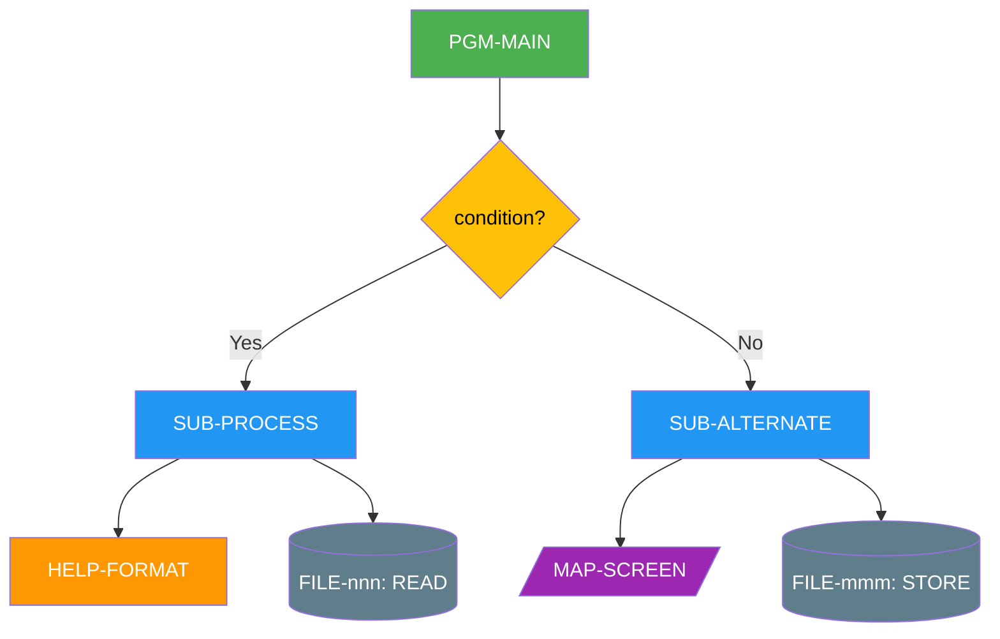
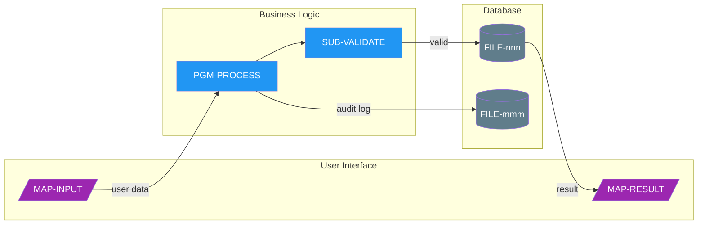
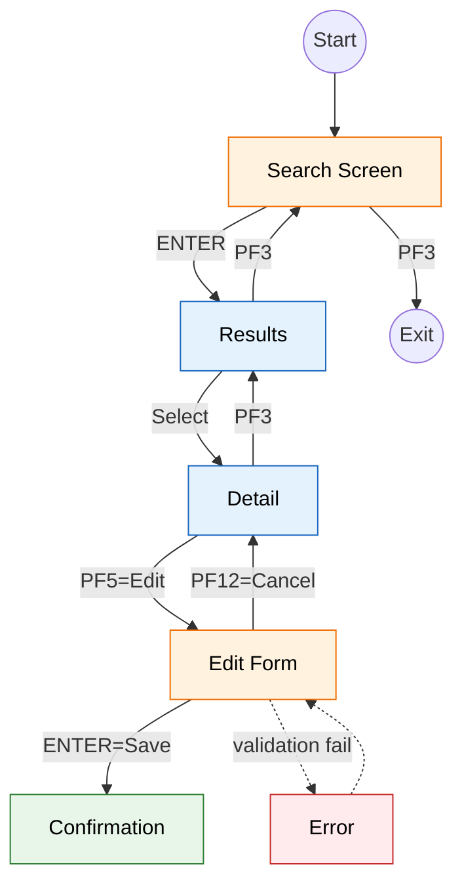
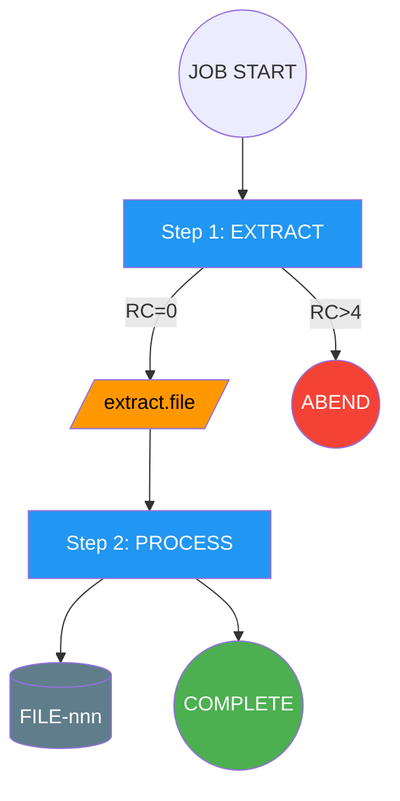
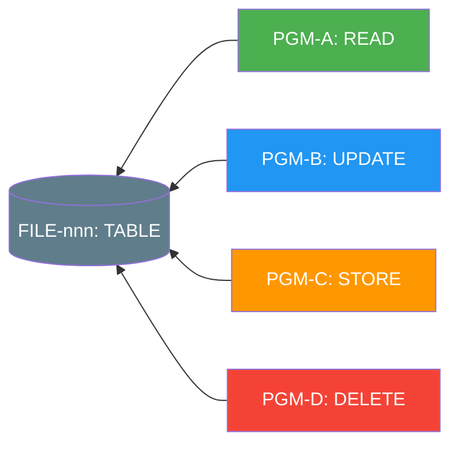
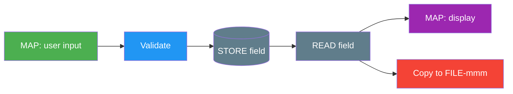
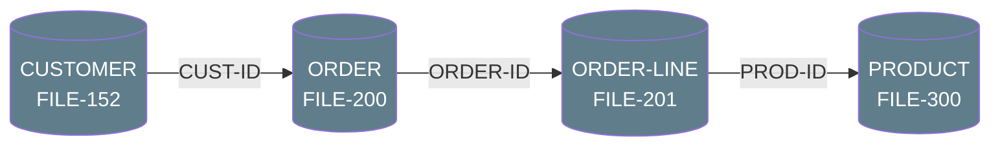
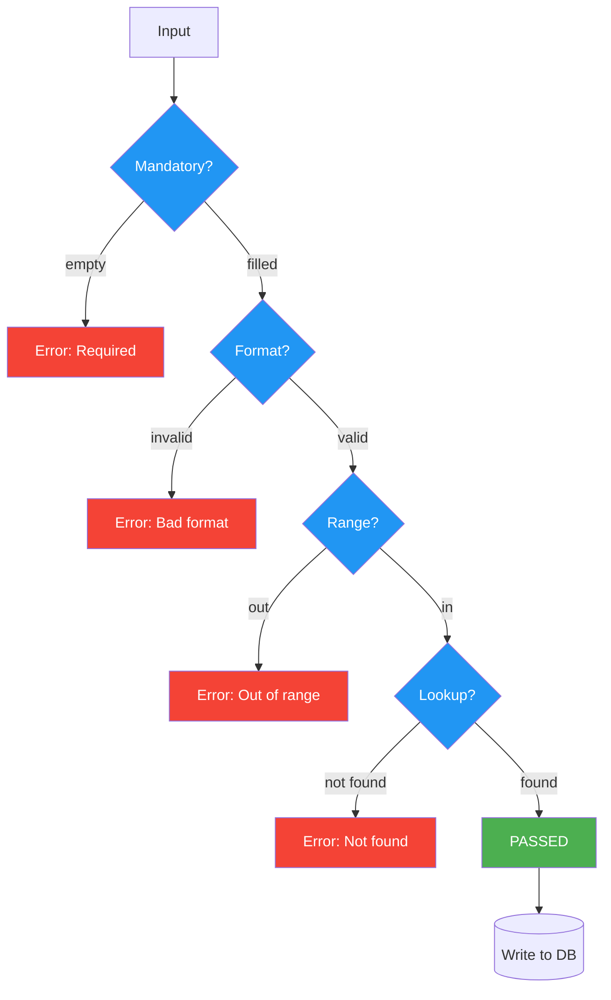

# Mermaid Diagram Templates

Ready-to-use Mermaid templates for mainframe code analysis. Copy and modify these templates when generating diagrams.

## Standard Colour Classes

Include these at the top of every diagram:

```mermaid
classDef prog fill:#4CAF50,color:#fff,stroke:#388E3C
classDef sub fill:#2196F3,color:#fff,stroke:#1565C0
classDef help fill:#FF9800,color:#fff,stroke:#EF6C00
classDef map fill:#9C27B0,color:#fff,stroke:#7B1FA2
classDef file fill:#607D8B,color:#fff,stroke:#455A64
classDef txn fill:#F44336,color:#fff,stroke:#C62828
classDef decision fill:#FFC107,color:#000,stroke:#F9A825
classDef readonly fill:#E3F2FD,stroke:#1565C0,color:#000
classDef editable fill:#FFF3E0,stroke:#EF6C00,color:#000
classDef confirm fill:#E8F5E9,stroke:#2E7D32,color:#000
classDef error fill:#FFEBEE,stroke:#C62828,color:#000
classDef step fill:#2196F3,color:#fff
classDef data fill:#FF9800,color:#000
classDef ok fill:#4CAF50,color:#fff
classDef fail fill:#F44336,color:#fff
```

## Template 1: Call Hierarchy



## Template 2: Data Flow with Swimlanes



## Template 3: Screen Navigation



## Template 4: JCL Job Flow



## Template 5: Bottom-Up File Access



## Template 6: Field Lineage



## Template 7: Entity Relationship



## Template 8: Validation Flow



## Complexity Guidelines

| Record Count | Approach |
|---|---|
| < 10 nodes | Single diagram, full detail |
| 10-25 nodes | One diagram, abbreviate labels |
| 25-50 nodes | Overview diagram + detail diagrams per subsystem |
| 50+ nodes | Multi-level: L0 overview, L1 per module, L2 per program |

## Node Label Conventions

- Programs: `[PGM-NAME<br/>brief purpose]`
- Files: `[(FILE-nnn<br/>TABLE-NAME)]`
- Maps: `[/MAP-NAME<br/>screen title/]`
- Decisions: `{condition?}`
- Data: `[/dataset.name/]`
- Start/End: `((label))`
