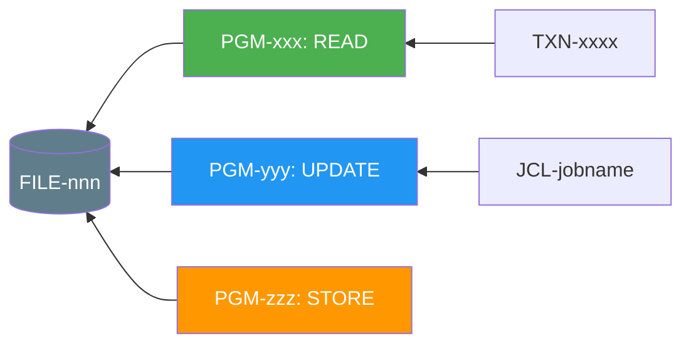
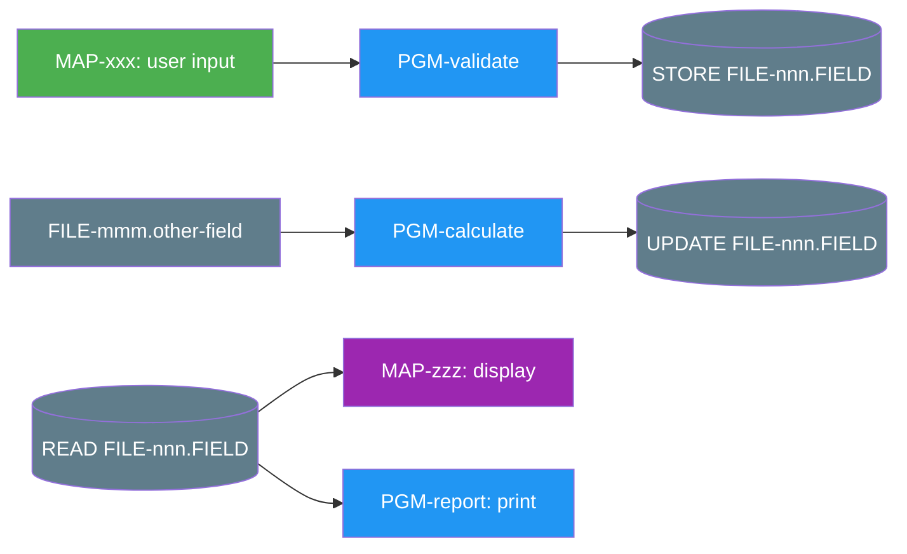

# Bottom-Up Trace (Adabas → Programs)

Trace from an Adabas file, DDM, or field upward through every program that touches it, up to the top-level entry point.

## Mode 1: File-Level Trace

When the user specifies an Adabas **file number** or **DDM name**, search the entire codebase for every reference.

### Analysis Steps

1. **Scan all programs** across all libraries for any statement referencing this DDM or file number
2. **Categorise each access** by operation type
3. **Trace callers** — for each program found, trace upward to find who calls it
4. **Identify triggers** — is it invoked online (CICS), batch (JCL), or interactively (menu)?

### Output Template

#### 1. File Identity
```
ADABAS FILE:  [number]
DDM NAME:     [name]
DATABASE ID:  [if known]
DESCRIPTION:  [inferred purpose from DDM field names]
```

#### 2. Program Access Inventory

| # | Program | Library | Type | Operation | Fields Read | Fields Written | Search Keys Used | Loop/Single | Error Handling | Top-Level Caller | Trigger (TXN/JCL/Menu) |
|---|---------|---------|------|-----------|-------------|----------------|------------------|-------------|----------------|-----------------|------------------------|

#### 3. Access Pattern Summary

| Operation | Count | Programs |
|-----------|-------|----------|
| READ / FIND | | |
| GET (by ISN) | | |
| STORE (insert) | | |
| UPDATE | | |
| DELETE | | |
| HISTOGRAM | | |

#### 4. Caller Chain (trace UP for each program)

For each program that accesses the file, build the upward chain:
```
FILE-152 ← PGM-UPDCUST ← PGM-CUSTMAINT ← TXN-CI01
FILE-152 ← SUB-GETCUST ← PGM-ORDERENTRY ← JCL-NIGHTBATCH Step 3
FILE-152 ← SUB-GETCUST ← PGM-CUSTINQ ← TXN-CI02
```

Show this as a Mermaid diagram with the file at the centre:



#### 5. Field Usage Matrix (which fields each program touches)

| Field Name | Short Name | PGM-1 (R/W) | PGM-2 (R/W) | PGM-3 (R/W) | ... |
|-----------|-----------|-------------|-------------|-------------|-----|

Mark each cell with R (read), W (write), RW (both), S (search key), or - (not used).

#### 6. Risk Assessment

- Fields written by multiple programs without coordination (conflict risk)
- Programs that UPDATE without reading first (blind update risk)
- Programs that DELETE without confirmation logic
- Missing ON ERROR handling on any database access

---

## Mode 2: Field-Level Reverse Trace

When the user specifies a **specific field** within a file, trace that single field everywhere.

### Output Template

#### 1. Field Identity
```
FIELD:        [long name]
SHORT NAME:   [2-char Adabas name]
FILE:         [number]
DDM:          [name]
FORMAT:       [A/N/P/B + length]
DESCRIPTOR:   [Y/N, super/sub/phonetic details]
```

#### 2. Write Origins (how data gets INTO this field)

For each program that writes this field:

| # | Program | Source of Value | Validation Before Write | Transformation Applied |
|---|---------|----------------|------------------------|----------------------|

**Source types**: user-input (from MAP field), calculation, another-file (FILE-mmm.FIELD), literal/hardcode, system-variable (*DATX, *TIMX, *USER), parameter-from-caller

#### 3. Read Destinations (how stored data is USED)

For each program that reads this field:

| # | Program | Assigned To | Used For | Passed To |
|---|---------|-------------|----------|-----------|

**Used for types**: display-on-map, if-condition, calculation, search-key, parameter-to-callnat, write-to-other-file, report-output

#### 4. Selection Usage

| # | Program | Statement | Comparison | Purpose |
|---|---------|-----------|------------|---------|

(e.g., FIND DDM-CUSTOMER WITH CUST-STATUS = 'A')

#### 5. Screen Presence

| # | Map Name | Map Field Name | Label on Screen | Editable? | AD= | EM= (mask) | CD= (colour) |
|---|----------|---------------|-----------------|-----------|-----|------------|--------------|

#### 6. Field Lineage Diagram (Mermaid)



## Cross-File Field Propagation

If this field's value is copied to other Adabas files, trace those too:

```
FILE-152.CUST-NAME → PGM-ORDERPROC → FILE-200.ORDER-CUST-NAME
FILE-152.CUST-NAME → PGM-HISTORY → FILE-300.HIST-NAME
```

Flag any cases where the field exists in multiple files but may drift out of sync.
