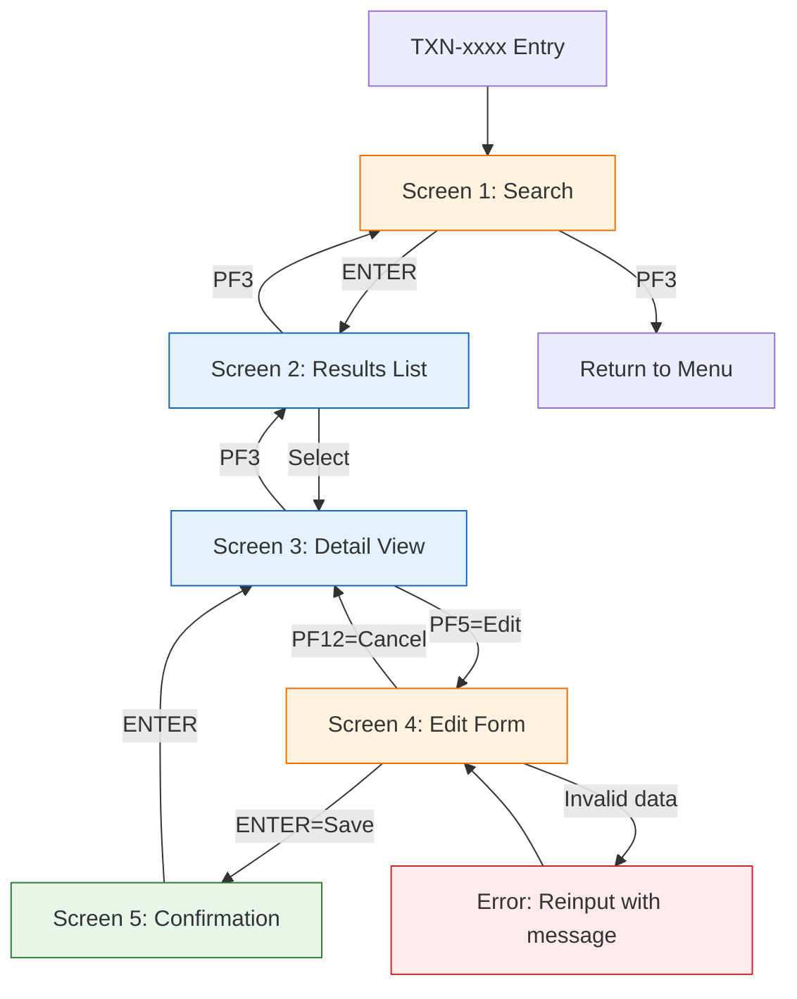
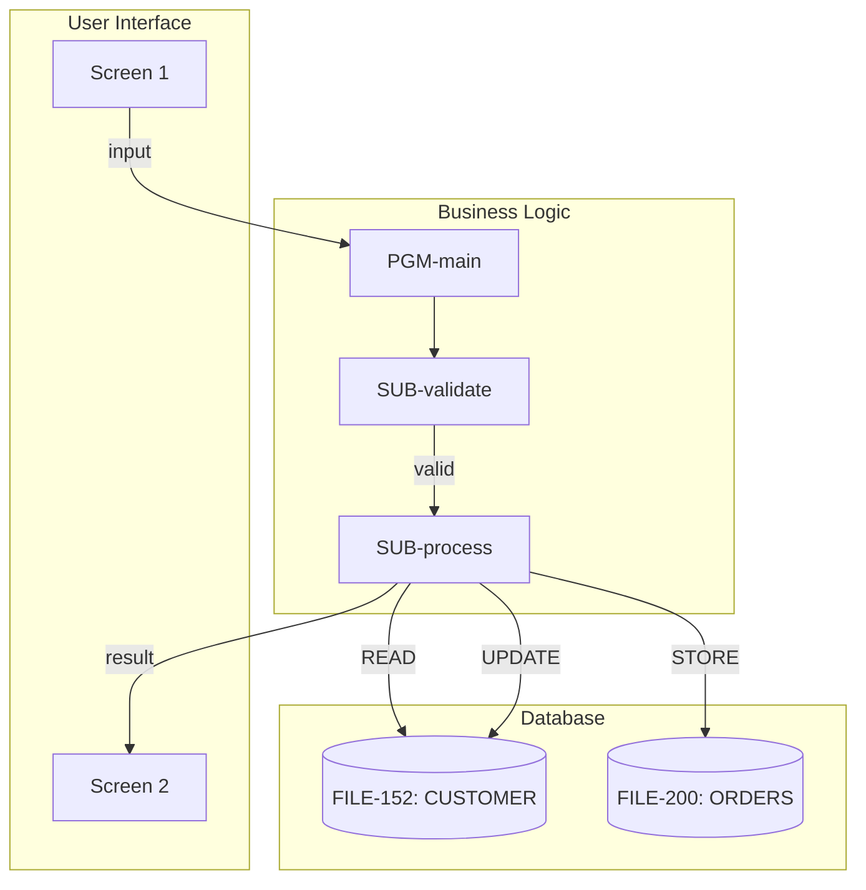

# CICS Transaction Analysis

Trace a CICS transaction from its ID through every program, screen, field, and database operation.

## Full Transaction Trace

### Section 1: Transaction Binding

```
TRANSACTION ID:  [4-char TXID]
DESCRIPTION:     [purpose]
INITIAL PROGRAM: [program name from PCT/CSD definition]
LANGUAGE:        [Natural / COBOL]
LIBRARY:         [library name]
```

If the PCT/CSD definition is not available, infer the initial program from the code provided.

### Section 2: Program Execution Chain

Build the complete chain of programs executed during this transaction:

| Sequence | Program | Language | Library | Invocation Method | Data Passed | Condition |
|----------|---------|----------|---------|-------------------|-------------|-----------|

**Invocation methods**:
- EXEC CICS LINK PROGRAM('name') COMMAREA(data)
- EXEC CICS XCTL PROGRAM('name') COMMAREA(data)
- EXEC CICS RETURN TRANSID('txid')
- CALLNAT 'name' parameters
- FETCH 'name'

Document the COMMAREA or parameter layout at each transition:
```
COMMAREA at LINK to PGM-B:
  Offset 0-3:   ACTION-CODE (A4)
  Offset 4-13:  CUSTOMER-ID (A10)
  Offset 14-14: RETURN-STATUS (A1)
```

### Section 3: Complete Screen Flow

Map every screen the user can encounter:

| Screen# | Map Name | BMS/Natural Map | Title/Header | Entry Condition | Exit Options |
|---------|----------|-----------------|-------------|-----------------|-------------|

**Screen Navigation Diagram** (Mermaid):


### Section 4: Field Visibility Inventory

For EVERY field on EVERY screen in this transaction:

| Screen | Row:Col | Label (on screen) | Field Name (internal) | Type | Len | Editable | Mandatory | Display Source | Edit Destination |
|--------|---------|-------------------|----------------------|------|-----|----------|-----------|---------------|-----------------|

**Display Source** = where the displayed value comes from:
- `FILE-nnn.FIELD` (from Adabas)
- `CALC: formula` (calculated)
- `LITERAL: 'text'` (hardcoded)
- `SYSTEM: *variable` (system variable like date/user)
- `PARAM: field` (from COMMAREA/parameter)

**Edit Destination** = where the entered value goes:
- `VALIDATE → STORE FILE-nnn.FIELD`
- `VALIDATE → UPDATE FILE-nnn.FIELD`
- `PASS → PGM-xxx.PARAM`

### Section 5: Validation Rules per Screen

For each editable field, document ALL validations:

| Screen | Field | Rule Type | Condition | Error Message | Severity (stop/warn) |
|--------|-------|-----------|-----------|---------------|---------------------|

**Rule types to detect**:
- `FORMAT` — must be numeric, must be date, must match mask
- `RANGE` — value between X and Y
- `MANDATORY` — cannot be blank/zero/spaces
- `LENGTH` — minimum or exact length required
- `CROSS-FIELD` — if field A = X then field B required
- `LOOKUP` — value must exist in reference table or another file
- `DUPLICATE` — check record doesn't already exist
- `TEMPORAL` — date not in future, date within business range
- `AUTHORISATION` — user must have specific role/permission

### Section 6: Database Access Map

All Adabas operations during this transaction, in execution sequence:

| Seq | Screen Context | Program | DDM | File# | Operation | Fields | Criteria | Purpose |
|-----|---------------|---------|-----|-------|-----------|--------|----------|---------|

Group by screen to show what DB work happens at each screen transition.

### Section 7: Error & Exception Handling

| # | Error Type | Detection Method | User Message | Recovery Action |
|---|-----------|-----------------|-------------|----------------|

Types to look for:
- EXEC CICS HANDLE CONDITION
- RESP / RESP2 code checking
- HANDLE ABEND
- ON ERROR in Natural
- IF *ISN(file) = 0 (record not found)
- REINPUT with error message

### Section 8: Transaction Summary Diagram

Combine everything into one comprehensive Mermaid diagram showing programs, screens, and database access:



## Screen Field Audit Mode

When the user specifically asks for a field audit (PROMPT P-09 style), focus exclusively on Sections 4 and 5, and add:

**Fields grouped by Adabas source:**
| Adabas File.Field | Screens Displaying | Screens Editing | Programs Populating |

**Orphan field detection:**
- Fields on screen with no Adabas backing
- Editable fields with zero validation rules
- Fields populated from hardcoded values (maintenance risk)
- Fields displayed but never from a consistent source
