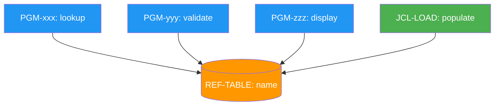

# DDM & Reference Table Analysis

Analyse Adabas data structures and reference/lookup tables.

## DDM Analysis Template

### 1. DDM Identity
```
DDM NAME:     [name]
ADABAS FILE:  [number]
DATABASE ID:  [DBID]
FIELD COUNT:  [total fields]
PURPOSE:      [inferred from field names]
```

### 2. Complete Field Inventory

| # | Short Name | Long Name | Level | Format | Length | Occ | Descriptor | S/M/P | Null | Group | Comment |
|---|-----------|-----------|-------|--------|--------|-----|-----------|-------|------|-------|---------|

**Column key:**
- Level: 01, 02, etc. (group hierarchy)
- Occ: occurrence count for MU (multiple value) or PE (periodic group)
- Descriptor: D=descriptor, S=superdescriptor, Sub=subdescriptor, P=phonetic, N=none
- S/M/P: S=superdescriptor component, M=MU field, P=PE group member

### 3. Key Structure

**Primary access:** ISN (Internal Sequence Number) or user-defined key

**Descriptors (indexed fields for efficient searching):**
| Descriptor | Field | Format | Unique? | Used In Programs |
|-----------|-------|--------|---------|-----------------|

**Superdescriptors (compound keys):**
| Super Name | Component Fields | Ranges | Format | Purpose |
|-----------|-----------------|--------|--------|---------|

Example: `SUPER-CUST = CUST-TYPE(1:2) + CUST-REGION(1:3) + CUST-ID(1:10)`

**Subdescriptors:**
| Sub Name | Parent Field | Range | Purpose |

**Phonetic descriptors:**
| Phonetic Name | Source Field | Purpose |

### 4. Group Structure

Show the hierarchical field grouping:
```
01 CUSTOMER-RECORD
  02 CUST-IDENTITY
    03 CUST-ID            (A10, descriptor)
    03 CUST-TYPE           (A2)
    03 CUST-NAME           (A50)
  02 CUST-ADDRESS (PE, max 5 occurrences)
    03 ADDR-TYPE           (A1)
    03 ADDR-LINE1          (A40)
    03 ADDR-LINE2          (A40)
    03 ADDR-CITY           (A30)
    03 ADDR-POSTCODE       (A10)
  02 CUST-CONTACTS (MU, max 10)
    03 CONTACT-PHONE       (A20)
```

### 5. Program Cross-Reference

Search the codebase for every program that uses this DDM:

| Program | Library | Operations (R/F/S/U/D/G/H) | Key Fields Used | Data Fields Used |
|---------|---------|---------------------------|----------------|-----------------|

R=READ, F=FIND, S=STORE, U=UPDATE, D=DELETE, G=GET, H=HISTOGRAM

### 6. Inferred Relationships

Identify fields that appear to reference other files (foreign keys):

| This File.Field | Likely References | Evidence |
|----------------|-------------------|---------|

Example: `FILE-200.ORDER-CUST-ID` likely references `FILE-152.CUST-ID`

---

## Reference Table Analysis Template

### 1. Table Identity
```
TABLE NAME:  [name]
LOCATION:    [Adabas file / Natural system file / hardcoded array / external file]
PURPOSE:     [what codes or values it contains]
KEY FIELD:   [the lookup key]
VALUE FIELDS:[the returned value(s)]
RECORD COUNT:[if known or estimable]
```

### 2. Table Structure

| Field | Format | Length | Key? | Description | Sample Values |
|-------|--------|--------|------|-------------|---------------|

### 3. Population Method

How and when is this table loaded/refreshed?
- Batch job (which JCL?)
- Manual maintenance (which program/screen?)
- System-generated
- Static (never changes)
- External feed

### 4. Consumer Programs

Every program that reads/looks up values from this table:

| Program | Library | Lookup Key Used | Values Retrieved | Purpose of Lookup |
|---------|---------|----------------|-----------------|-------------------|

### 5. Impact Analysis

If a value in this table changes or a new entry is added:
- Which programs need to handle the new value?
- Which screens display values from this table?
- Are there IF/DECIDE statements that check for specific values? (hardcoded references)
- Does any program cache this table in memory? (stale data risk)

### 6. Dependency Diagram


