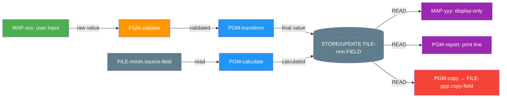

# Field-Level Traceability

Trace a single field across its complete lifecycle in the system.

## Required Input

The user must provide at minimum:
- Field name (long name or short name)
- Adabas file number or DDM name

If not provided, ask for these before proceeding.

## Analysis Template

### 1. Field Definition

```
FIELD NAME:       [long name in DDM]
SHORT NAME:       [2-character Adabas name, e.g., AA, AB]
DDM:              [DDM name]
ADABAS FILE:      [file number]
FORMAT:           [A=alpha, N=numeric, P=packed, B=binary + length]
DESCRIPTOR:       [None / Descriptor / Superdescriptor / Sub-descriptor / Phonetic]
SUPER COMPONENTS: [if superdescriptor, list component fields and ranges]
NULLABLE:         [Y/N]
DEFAULT VALUE:    [if any]
MU/PE:            [if part of multiple-value or periodic group, state group name and occurrence]
```

### 2. Write Path — How Data Enters This Field

For every program that writes (STORE or UPDATE) this field:

| # | Program | Library | Source of Value | Validation Before Write | Transformation | Context |
|---|---------|---------|----------------|------------------------|----------------|---------|

**Source of Value categories:**
- `USER-INPUT: MAP-xxx.field-name` — typed by user on a screen
- `CALCULATED: formula/expression` — computed by the program
- `ANOTHER-FILE: FILE-mmm.field-name via DDM-yyy` — read from a different Adabas file
- `PARAMETER: param-name from caller PGM-xxx` — passed in from calling program
- `LITERAL: 'value'` — hardcoded constant
- `SYSTEM: *DATX / *TIMX / *USER / *PROGRAM` — Natural system variable
- `COUNTER: auto-increment or sequence logic` — generated identifier
- `DEFAULT: assigned if no other value` — fallback value

**Transformation categories:**
- `NONE` — value stored as-is
- `UPPER-CASE` — converted to uppercase
- `FORMAT-CONVERT` — date format change, number format change
- `TRUNCATE` — shortened to fit field length
- `CONCATENATE` — combined with other values
- `MASK/ENCRYPT` — partially hidden or encrypted
- `CALCULATE` — derived from formula involving other fields

### 3. Read Path — How Stored Data Is Used

For every program that reads this field:

| # | Program | Library | Assigned To Variable | Used For | Passed To | Transformed? |
|---|---------|---------|---------------------|----------|-----------|-------------|

**Used For categories:**
- `DISPLAY: MAP-xxx.field-name` — shown on screen
- `IF-CONDITION: compared to value/field` — used in decision logic
- `CALCULATION: part of formula` — used in arithmetic
- `SEARCH-KEY: FIND/READ BY` — used to locate other records
- `PARAMETER: passed to SUB-xxx` — sent to another program
- `WRITE-OTHER: STORE/UPDATE FILE-mmm.field` — written to a different file
- `REPORT: written to print/output` — included in report output
- `SORT-KEY: used in SORT statement` — ordering criterion

### 4. Selection/Search Usage

Where this field is used as a search criterion:

| # | Program | Statement | Operator | Compared To | Purpose |
|---|---------|-----------|----------|-------------|---------|

Example: `FIND DDM-CUSTOMER WITH CUST-STATUS = 'A'`

Note whether the field is a descriptor (efficient search) or non-descriptor (sequential scan) — this has performance implications.

### 5. Screen Presence

Every map/screen where this field appears:

| # | Map Name | Transaction | Field Label (visible) | Map Field Name | Row:Col | Editable | AD= | EM= (edit mask) | CD= (colour) | CV= (control var) |
|---|----------|-------------|----------------------|---------------|---------|----------|-----|-----------------|-------------|-------------------|

### 6. Cross-File Propagation

If this field's value is ever written to OTHER Adabas files:

```
SOURCE: FILE-152.CUST-NAME
  ├── PGM-ORDERPROC → FILE-200.ORDER-CUST-NAME (on order creation)
  ├── PGM-HISTWRITE → FILE-300.HIST-CUST-NAME (on status change)
  └── PGM-ARCHIVE  → FILE-500.ARCH-CUST-NAME (on year-end archive)
```

**Synchronisation risk**: Are these copies kept in sync? Is there a single update point or can they drift?

### 7. Complete Lineage Diagram



### 8. Findings

- **Validation gaps**: Write paths with no validation before STORE/UPDATE
- **Sync risks**: Cross-file copies that may drift
- **Performance**: Non-descriptor field used as search key
- **Security**: Sensitive field displayed without masking
- **Orphans**: Field in DDM but not referenced by any program
