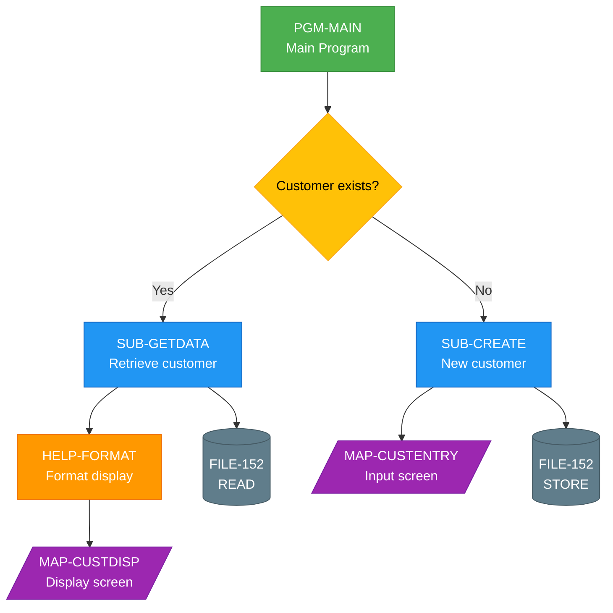
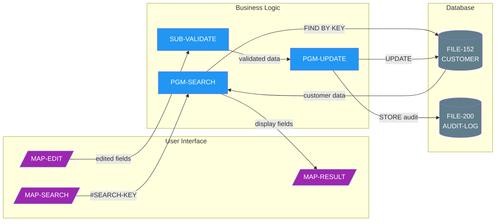
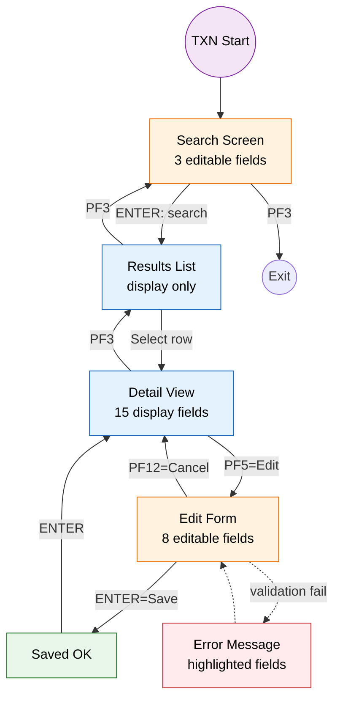
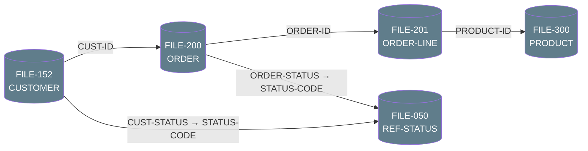
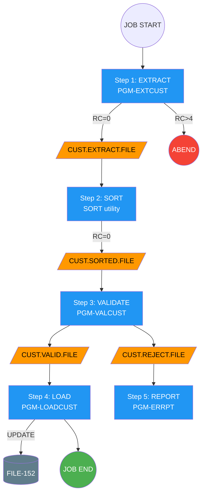

# Flowchart & Diagram Generation

Generate production-ready Mermaid diagrams from mainframe code analysis.

## Diagram Types

### Type 1: Call Hierarchy (graph TD)

Shows program call chains, top-down.

**Rules:**
- Entry program at top
- Rectangles for programs (with class)
- Rounded rectangles or cylinders for Adabas files
- Parallelograms for maps/screens
- Diamonds for decisions
- Edge labels for conditions and key parameters
- Shared subprograms shown once with multiple incoming edges

### Type 2: Data Flow Diagram (graph LR)

Shows how data moves through the system, left-to-right.

**Rules:**
- Use swimlane subgraphs: User Interface, Business Logic, Database
- Edge labels show field names or operation types
- Direction of arrow shows data movement
- Bidirectional flows use two separate edges

### Type 3: Screen Navigation (graph TD)

Shows the user's journey through screens.

**Rules:**
- Annotate each screen node with field counts
- Colour-code: blue=read-only, orange=editable, green=confirmation, red=error
- Solid arrows for normal flow, dashed for error/exception flow
- PF-key labels on edges
- Round nodes for entry/exit points

### Type 4: Entity Relationship (graph LR)

Shows Adabas file relationships.

### Type 5: Job Flow (graph TD)

Shows batch JCL execution flow.

## Complexity Guidelines

- **Simple** (< 10 nodes): Single diagram, all detail
- **Medium** (10-25 nodes): One main diagram with annotations
- **Complex** (25+ nodes): Break into multiple diagrams — overview + detail views
  - Overview: top-level programs and files only
  - Detail: one diagram per major branch/subsystem

## Common Patterns to Recognise

When generating diagrams, look for and label these patterns:
- **Hub**: One program called by many others (shared utility)
- **Pipeline**: Linear A→B→C→D processing chain
- **Fan-out**: One program calls many subprograms
- **Fan-in**: Many programs call one shared subprogram
- **Loop**: READ/FIND loop processing multiple records
- **Master-Detail**: Parent record lookup followed by child record processing
