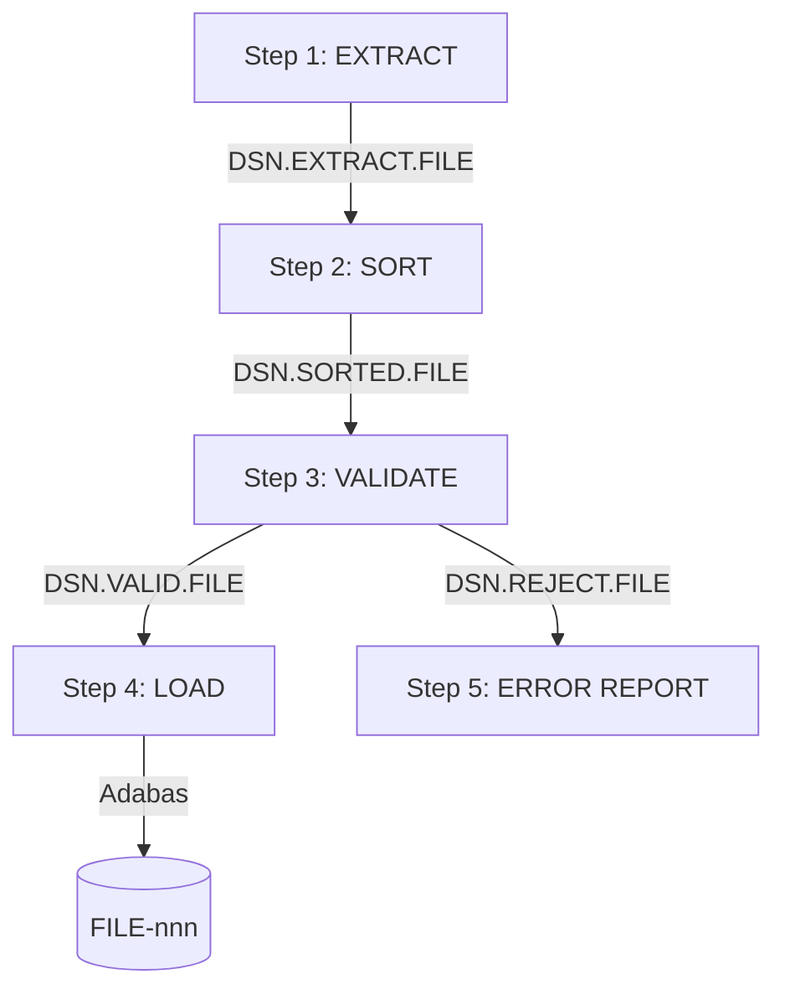
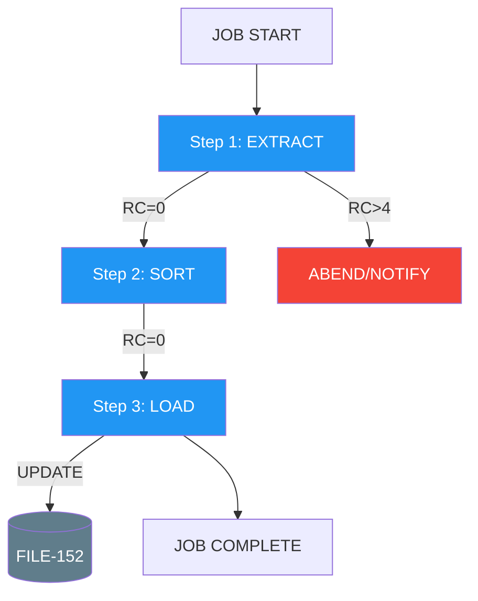

# JCL Job Flow Analysis

Analyse JCL job streams to document execution flow, program invocations, and data movement.

## Full JCL Analysis Template

### 1. Job Identity

```
JOB NAME:    [from JOB card]
CLASS:       [execution class]
MSGCLASS:    [output class]
NOTIFY:      [notification user]
SCHEDULE:    [if known — daily, weekly, month-end, etc.]
PURPOSE:     [inferred from job name, steps, and programs]
```

### 2. Step-by-Step Breakdown

| Step# | Step Name | EXEC PGM/PROC | PARM | COND/IF | Expected RC | Purpose |
|-------|-----------|---------------|------|---------|-------------|---------|

For PROC references, expand inline or note that the PROC should be provided.

### 3. Dataset (DD) Inventory

| Step | DD Name | DSN (Dataset Name) | DISP (NEW/OLD/SHR/MOD) | SPACE | DCB | Purpose | Maps to Adabas? |
|------|---------|--------------------|-----------------------|-------|-----|---------|----------------|

**Key DD names to flag:**
- SYSIN — input parameters/control cards
- SYSOUT / SYSPRINT — output/reporting
- CMSYNIN — Natural batch input
- CMPRINT — Natural batch output
- Work files (CMWKF01-nn)

### 4. Program Chain

For each EXEC PGM step, identify the program and trace what it does:

| Step | Program | Language | Adabas Files Accessed | Operation | Key Fields | Input From | Output To |
|------|---------|----------|-----------------------|-----------|------------|-----------|-----------|

If the program source is available, invoke the `top-down-trace` skill for a SURFACE SCAN of each.

### 5. Data Pipeline

Show how data flows between steps via datasets:



### 6. Condition Code Logic

Map the step execution dependencies:

| Step | Executes When | Skips When | Depends On |
|------|--------------|-----------|------------|

For IF/THEN/ELSE/ENDIF constructs, show the branching logic.

### 7. Error Handling

- Steps with no COND parameter (always execute)
- Steps that run only on failure (RC > threshold)
- Notification steps (email, message queue)
- Restart/recovery points

### 8. JCL-to-Adabas Mapping

Combined view of all Adabas access across all steps:

| Step | Program | File# | DDM | Operation | Fields | Selection | Est. Volume |
|------|---------|-------|-----|-----------|--------|-----------|-------------|

### 9. Job Flow Diagram



### 10. Scheduling Dependencies

If determinable from the JCL or job definitions:
- Predecessor jobs (must complete before this runs)
- Successor jobs (triggered after this completes)
- Resource locks (exclusive dataset access)
- Time windows (must start/end by specific time)
