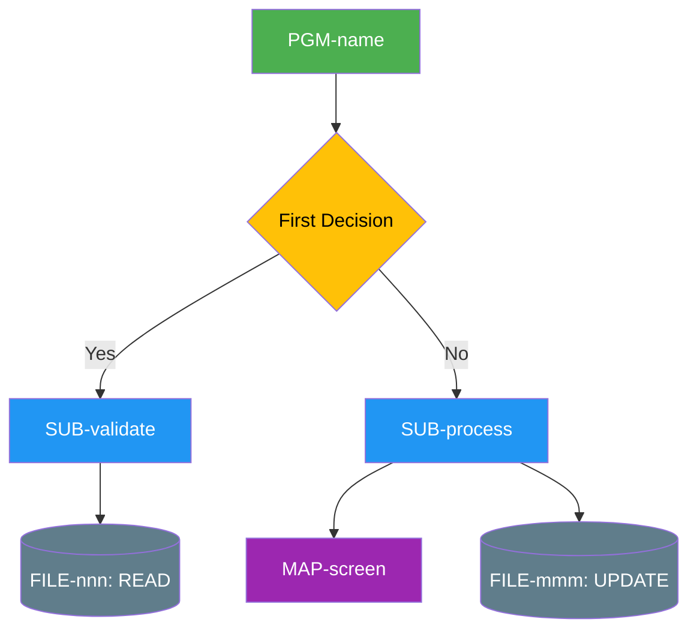

# Top-Down Program Trace

Trace from a program entry point downward through every call chain and database access.

## Two Modes

### Mode 1: DEEP DIVE (default for single programs)

Perform an exhaustive recursive trace. Follow every CALLNAT, FETCH, PERFORM, CALL to its terminal point. Document every database operation, every map interaction, every decision branch.

### Mode 2: SURFACE SCAN (when user says "surface scan" or "quick summary")

One-page summary only. List programs called, files accessed, key rules. No recursive tracing.

## Deep Dive Analysis Template

When performing a DEEP DIVE, produce ALL of these sections in order:

### Section A: Program Identity

```
PROGRAM:  [name from source]
LIBRARY:  [inferred from file path]
TYPE:     [program / subprogram / helproutine / subroutine / map]
LANGUAGE: [Natural / COBOL]
PURPOSE:  [1-2 sentence business function summary]
```

Then document:
- DEFINE DATA PARAMETER block — every parameter with name, format, direction (in/out/inout)
- LOCAL data areas (LDAs) referenced via DEFINE DATA LOCAL USING
- GLOBAL data areas (GDAs) referenced via DEFINE DATA GLOBAL USING
- Parameter data areas (PDAs) if any

### Section B: Complete Call Chain

For EVERY call statement found (CALLNAT, FETCH, PERFORM SUBROUTINE, CALL, EXEC CICS LINK/XCTL):

| # | Statement | Called Program | Library | Parameters Passed | Direction | Condition for Call | Return Values |
|---|-----------|---------------|---------|-------------------|-----------|-------------------|---------------|

**Recursive rule**: If a called program's source is available, trace into it and produce the same table. Build a nested tree:
```
PGM-MAIN
  ├── CALLNAT SUB-VALIDATE (params: #CUST-ID, #STATUS)
  │   ├── CALLNAT SUB-CHECKDATE (params: #DATE-IN)
  │   └── CALLNAT SUB-LOOKUP (params: #CODE, #DESC)
  │       └── READ FILE-200 via DDM-REFTABLE
  ├── CALLNAT SUB-PROCESS (params: #CUST-REC)
  │   └── UPDATE FILE-152 via DDM-CUSTOMER
  └── INPUT MAP-CUSTDISP
```

### Section C: Database Operations

For EVERY database statement (READ, FIND, STORE, UPDATE, DELETE, GET, HISTOGRAM, READ WORK FILE, WRITE WORK FILE):

| # | Program | DDM Name | File# | Operation | Fields Read | Fields Written | Search Criteria | Descriptors Used | Loop Context | ON ERROR? |
|---|---------|----------|-------|-----------|-------------|----------------|-----------------|------------------|-------------|-----------|

**Loop context values**: SINGLE (one record), LOOP (in READ/FIND loop), NESTED (loop within loop), FIRST-ONLY (READ...FIND with LIMIT 1)

### Section D: Screen/Map Interactions

For every INPUT, WRITE, REINPUT, SEND MAP, RECEIVE MAP:

| # | Program | Map Name | Action (INPUT/WRITE/REINPUT) | Fields Displayed (source) | Fields Accepted (destination) | AD= Control | PF-Key Handling |
|---|---------|----------|------------------------------|---------------------------|-------------------------------|-------------|-----------------|

### Section E: Business Logic & Validation

For every IF, DECIDE ON, DECIDE FOR, EVALUATE, condition:

| Rule# | Program:Location | Condition (pseudocode) | True Action | False Action | Business Meaning |
|-------|-----------------|----------------------|-------------|--------------|------------------|

Focus on conditions that:
- Validate user input
- Control program flow (which subroutine to call)
- Determine database operation (insert vs update)
- Check error conditions

### Section F: Mermaid Call-Chain Flowchart

Generate a top-down Mermaid flowchart. Template:



### Section G: Issues & Observations

List all findings:
- ⚠️ RISK items (missing error handling, unvalidated input, etc.)
- 💀 DEAD CODE (unreachable branches, unused variables)
- 🔴 MISSING components (referenced programs not provided)
- 📌 NOTES (patterns, optimization opportunities)

## Surface Scan Template

When performing a SURFACE SCAN, use this compact format:

```
PURPOSE:  [1-2 sentences]
LIBRARY:  [name]
TYPE:     [type]

PROGRAMS CALLED:
- [name] — [purpose] — [library]

ADABAS FILES ACCESSED:
| File# | DDM | R | W | U | D |
(use ✓ for each operation type)

KEY BUSINESS RULES:
- [rule 1]
- [rule 2]

RISK AREAS:
- [risk 1]
```

## Multi-Program Batch Mode

When the user provides multiple programs, analyse each individually then produce:

**Cross-Reference Matrix:**
| Program | Calls | Called By | Files Read | Files Written |

**Shared Data Matrix:**
| Adabas File | DDM | Programs Reading | Programs Writing |

**Dependency Diagram** (Mermaid showing all programs and their connections)
