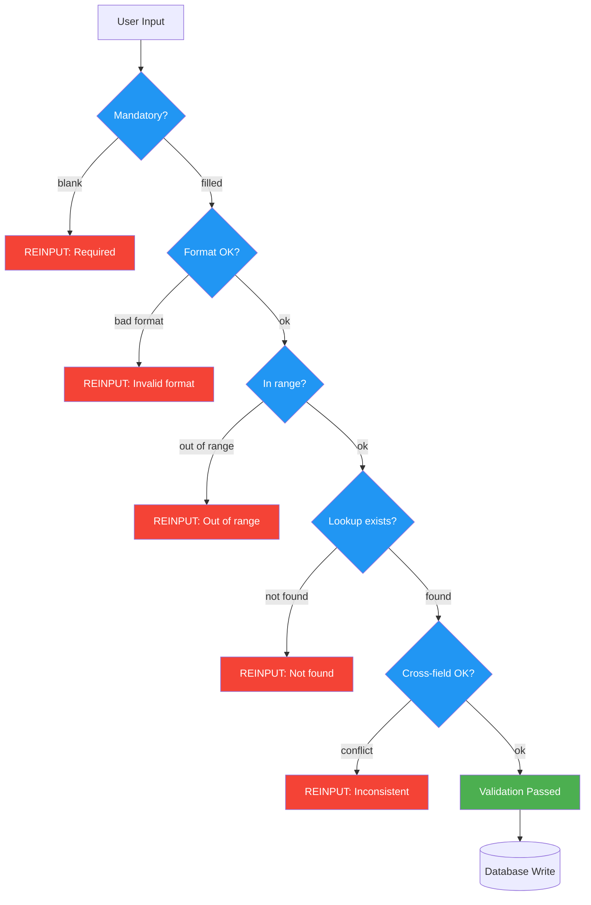

# Validation & Business Rule Extraction

Extract, categorise, and document every validation rule and business rule from mainframe code.

## Rule Detection Patterns

When scanning code, look for these Natural/COBOL patterns:

### Natural Patterns
```
IF #FIELD = ' ' OR = 0              → MANDATORY check
IF #FIELD < value OR > value         → RANGE check
IF NOT MASK(#FIELD) = 'NNNN'        → FORMAT check
IF #FIELD-A = 'X' AND #FIELD-B = ' '→ CROSS-FIELD check
FIND DDM WITH KEY = #FIELD ... IF NO RECORDS FOUND → LOOKUP check
IF #DATE > *DATX                     → TEMPORAL check
REINPUT 'error message'              → Error action with message
INPUT ... (AD=M)                     → Mandatory field on map
IF *USER <> 'ADMIN'                  → SECURITY check
DECIDE ON EVERY VALUE OF #FIELD      → Multi-value business logic
```

### COBOL Patterns
```
IF FIELD = SPACES                    → MANDATORY check
IF FIELD NUMERIC                     → FORMAT check
EVALUATE FIELD                       → Multi-value business logic
PERFORM VALIDATE-xxx                 → Validation subroutine
IF FIELD > WS-MAX-VALUE              → RANGE check
CALL 'TABLOOKUP' USING FIELD        → LOOKUP check
```

## Output Template

### 1. Validation Rule Inventory

| Rule# | Program:Location | Field(s) | Rule Type | Condition (pseudocode) | Error Action | Error Message | Severity |
|-------|-----------------|----------|-----------|----------------------|-------------|---------------|----------|

**Rule Types:**
- `MANDATORY` — field cannot be blank/zero/spaces
- `FORMAT` — must match pattern (numeric, date, alphanumeric, mask)
- `RANGE` — value within min-max bounds
- `LENGTH` — minimum or exact length
- `CROSS-FIELD` — dependent on another field's value
- `LOOKUP` — must exist in reference table or another file
- `DUPLICATE` — must NOT exist (uniqueness check before STORE)
- `TEMPORAL` — date-based rule (not future, within period, business days)
- `SECURITY` — user role or permission check
- `STATE` — status transition rules (e.g., can only go Active→Closed)
- `CALCULATION` — computed value must meet condition
- `CUSTOM` — complex business-specific logic

**Severity:**
- `STOP` — processing halts, REINPUT or ESCAPE
- `WARN` — message displayed but processing continues
- `LOG` — recorded but no user notification

### 2. Business Rule Catalogue

Group rules by category:

#### Category A: Data Integrity Rules
Rules that protect data quality — validations, format checks, uniqueness.

| Rule ID | Description | Implementing Code | Programs | Dependencies |
|---------|-------------|-------------------|----------|-------------|

#### Category B: Workflow / State Rules
Rules that control process flow — if status = X, allow Y; required sequence of operations.

| Rule ID | Description | Current State | Allowed Actions | Programs |
|---------|-------------|--------------|-----------------|----------|

#### Category C: Calculation Rules
Formulas, rates, aggregations, derived values.

| Rule ID | Description | Formula (pseudocode) | Input Fields | Output Field | Programs |
|---------|-------------|---------------------|-------------|-------------|----------|

#### Category D: Security / Authorisation Rules
User-level checks, role restrictions, data visibility.

| Rule ID | Description | Check Against | Deny Action | Programs |
|---------|-------------|--------------|------------|----------|

#### Category E: Temporal Rules
Date-based logic, period processing, aging, cutoff dates.

| Rule ID | Description | Date Fields | Rule | Programs |
|---------|-------------|------------|------|----------|

### 3. Missing Validation Report

Identify gaps — places where validation SHOULD exist but does not:

| # | Program | Field | Issue | Risk Level | Recommendation |
|---|---------|-------|-------|-----------|----------------|

Common gaps to detect:
- Editable map fields with NO validation before database write
- Numeric fields accepted without FORMAT check
- Date fields accepted without range/validity check
- STORE operations without duplicate check
- UPDATE operations without record-lock or optimistic concurrency
- Fields used as search keys without existence check on input
- DELETE operations without confirmation or soft-delete pattern

### 4. Validation Flow Diagram


