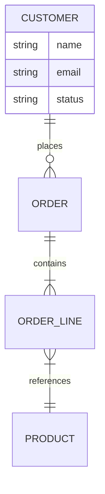

# Database Schema Reverse Engineer

Produce a business-language logical data model from JPA entities and DB migrations.

## Step 1 — Entity Discovery
```bash
# All JPA entities
find <java_path> -name "*.java" | xargs grep -l "@Entity\|@Document\|@Table" 2>/dev/null

# Entity fields and constraints
grep -rn "@Column\|@Id\|@GeneratedValue\|@NotNull\|@Size\|@OneToMany\|@ManyToOne\|\
  @OneToOne\|@ManyToMany\|@Enumerated\|@Embedded\|@ElementCollection\|@Version" \
  <java_path> --include="*.java" | head -200

# Liquibase / Flyway migrations (for constraints not in Java)
find <java_path> -name "*.xml" -o -name "*.sql" -o -name "*.yaml" | \
  grep -i "liquibase\|flyway\|migration\|changelog\|V[0-9]" | head -20
```

## Step 2 — Relationship Extraction
For each `@OneToMany`, `@ManyToOne`, `@ManyToMany`, `@OneToOne`:
- Identify parent and child in business terms
- Determine cardinality: "One Customer has many Orders"
- Determine cascade behaviour in plain English: "Deleting a Customer also deletes all their Orders"
- Identify ownership: "Order references Customer (Order is the owner)"

## Step 3 — Translate to Business Language
Apply these translations (never output technical names):
- `@Entity Customer` → "Customer Record"
- `@Column(name="cust_id")` → field name from Java field, not column name
- `@NotNull` → "Required"
- `@Size(max=100)` → "Maximum 100 characters"
- `@Enumerated` → "Selection: [list enum values in plain English]"
- `@Version` → "Supports concurrent editing (last-write detection)"
- `TIMESTAMP` / `LocalDateTime` → "Date and time"
- `BIGINT` / `Long` → "Whole number"

## Step 4 — Output

### Entity Catalogue
For each entity:
```
ENTITY: [Business Name]
Purpose: [What this represents in the business]
Key identifier: [Plain English name of the ID]

Fields:
| Field Name | Required | Format | Allowed Values | Notes |
|---|---|---|---|---|

Status lifecycle (if status field exists):
[Draft] → [Submitted] → [Approved / Rejected]
  ↓
[Cancelled]
```

### Entity Relationship Diagram (Mermaid)


### Referential Integrity Rules
| Parent Entity | Child Entity | On Delete | On Update |
|---|---|---|---|
| Customer | Order | Prevent deletion if orders exist | Cascade to orders |
