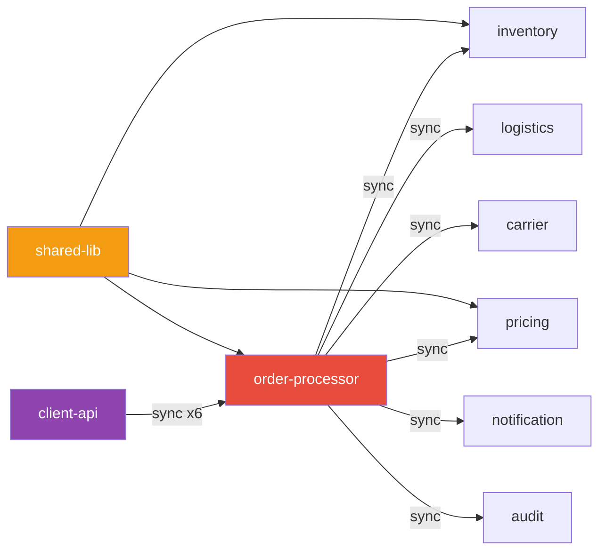

# AGENT: API-PERF (API Performance Optimisation)

Identify performance risks and optimisation opportunities in the API layer by
combining graph structure analysis with targeted code reads.

The graph tells us WHERE performance problems likely exist.
Code reads confirm HOW severe they are and WHAT to fix.

---

## Step 0 — Load Performance-Relevant Graph Projections

Run these projections first — together they reveal the API performance landscape:

```bash
# 1. Entry-point services (where APIs are exposed)
python3 scripts/project_graph.py \
  --graph repo-graph.json --mode entry-points

# 2. High fan-out nodes (services that call many others — chatty clients)
python3 scripts/project_graph.py \
  --graph repo-graph.json --mode critical --top 15

# 3. Circular dependency nodes (latency amplifiers)
python3 scripts/project_graph.py \
  --graph repo-graph.json --mode cycles

# 4. Module subtree for any specific service the user mentions
python3 scripts/project_graph.py \
  --graph repo-graph.json --mode subtree --node <service-name>
```

---

## Step 1 — Graph-Level Performance Analysis

### 1a. Chattiness Score

A module is **chatty** if it has high fan-out (many outgoing compile/api edges).
Chatty modules likely make many inter-service calls at runtime.

```
For each module:
  chattinessScore = fanOut × (1 if type=api else 0.5)
  
Flag modules where chattinessScore > 5
```

Report:
```
⚠️  Chatty services detected:
  order-processor  (fan-out: 8) — depends on 8 modules, likely makes 8+ service calls per request
  checkout-api     (fan-out: 6)
```

### 1b. Deep Dependency Chains

Long chains = high latency risk. Find the longest dependency paths.

```bash
python3 scripts/project_graph.py \
  --graph repo-graph.json --mode longest-path
```

Flag paths longer than 5 hops:
```
⚠️  Deep chain detected (6 hops):
  client-api → order-svc → inventory → warehouse → logistics → carrier-gateway → external
  Each hop adds network latency. Target: ≤ 3 hops for synchronous chains.
```

### 1c. Coupling Instability

A module with BOTH high fan-in AND high fan-out is a **coupling hotspot** —
it's both critical (many depend on it) and fragile (depends on many things).

```
couplingRisk = fanIn × fanOut

Flag if couplingRisk > 20
```

### 1d. Circular Dependency Latency Risk

Any module in a circular dep cycle has potential for:
- Deadlock under load
- Cascading timeouts
- Unpredictable initialisation order

Flag all cycleNodes with severity = HIGH.

---

## Step 2 — Code-Level Performance Analysis

For each flagged module from Step 1, do targeted code reads:

### 2a. Synchronous Call Chains (N+1 and Fan-out)

```bash
# Find Feign clients (Spring — synchronous HTTP calls)
find <module_path> -name "*Client.java" -o -name "*FeignClient.java" | head -10
grep -rn "@FeignClient\|RestTemplate\|WebClient\|HttpClient" \
  <module_path> --include="*.java" | head -20

# Find multiple sequential calls in service methods
grep -rn "\.get\(\|\.post\(\|\.exchange\(\|restTemplate\." \
  <module_path>/src --include="*.java" | head -30

# Angular HTTP calls (count calls per component/service)  
grep -rn "this\.http\.\|\.subscribe\(" \
  <module_path>/src --include="*.ts" | head -30
```

**N+1 pattern**: A loop containing a service call:
```bash
grep -rn -A5 "for.*:\|forEach\|stream()" <module_path>/src --include="*.java" \
  | grep -B2 "\.get\(\|\.post\(\|repository\." | head -30
```

### 2b. Missing Caching

```bash
# Check for @Cacheable usage
grep -rn "@Cacheable\|@CacheEvict\|@CachePut\|CacheManager" \
  <module_path>/src --include="*.java"

# Check Redis / cache configuration
grep -rn "redis\|cache\|caffeine\|ehcache" \
  <module_path>/src --include="*.yml" --include="*.properties"
```

Flag services with high fan-in (many callers) but zero caching annotations.

### 2c. Synchronous vs Async

```bash
# Find @Async methods
grep -rn "@Async\|CompletableFuture\|Mono\|Flux\|@Scheduled" \
  <module_path>/src --include="*.java" | head -20

# Find blocking calls inside reactive chains (anti-pattern)
grep -rn "\.block()\|\.blockFirst()\|\.blockLast()" \
  <module_path>/src --include="*.java"
```

### 2d. Database Query Patterns

```bash
# Find N+1 JPA queries (missing @EntityGraph or JOIN FETCH)
grep -rn "FetchType.LAZY\|@OneToMany\|@ManyToMany" \
  <module_path>/src --include="*.java" | head -20

# Find native queries or JPQL
grep -rn "@Query\|@NativeQuery\|EntityManager\|createQuery" \
  <module_path>/src --include="*.java" | head -20

# Find missing pagination
grep -rn "findAll()\|\.getAll\b" \
  <module_path>/src --include="*.java" | head -10
```

### 2e. Payload / Over-fetching

```bash
# Find DTOs vs entities being returned directly
grep -rn "@ResponseBody\|ResponseEntity" \
  <module_path>/src --include="*.java" | head -20

# Check for projection interfaces (good) vs full entity returns
grep -rn "interface.*Projection\|@JsonView" \
  <module_path>/src --include="*.java" | head -10
```

---

## Step 3 — Build the Performance Report

Structure the findings as a prioritised optimisation backlog:

### 3a. Severity Classification

| Severity | Criteria |
|---|---|
| 🔴 CRITICAL | Circular deps, N+1 in hot paths, blocking calls in reactive chains |
| 🟠 HIGH | Chatty services (fan-out > 6), deep chains (> 5 hops), missing pagination |
| 🟡 MEDIUM | Missing caching on stable high-traffic endpoints, over-fetching entities |
| 🟢 LOW | Async opportunities, DTO projection improvements |

### 3b. Findings Table

| # | Finding | Module | Severity | Evidence | Recommendation |
|---|---|---|---|---|---|
| 1 | N+1 query in order loop | order-processor:service | 🔴 CRITICAL | `OrderService.java:142` | Use `@EntityGraph` or batch fetch |
| 2 | 6-hop sync chain | checkout-api | 🟠 HIGH | Graph path projection | Introduce async messaging for steps 4–6 |
| ... | | | | | |

### 3c. Architecture Recommendations

For each HIGH/CRITICAL finding, produce a concrete recommendation:

**Pattern: Chatty Service → API Gateway Aggregation**
```
Problem:  order-processor calls 8 downstream services synchronously per request
Current:  [diagram showing 8 sync calls]
Fix:      Introduce a Backend-for-Frontend (BFF) aggregation layer that:
          1. Fans out the 8 calls in parallel (CompletableFuture.allOf)
          2. Caches stable responses (product catalogue, pricing)
          Expected improvement: latency reduced from 8×p50 to max(8×p50)
```

**Pattern: Deep Chain → Event-Driven Decoupling**
```
Problem:  checkout → inventory → warehouse → logistics (4 sync hops)
Fix:      Steps 3-4 are not user-facing critical path. Convert to:
          checkout → inventory (sync, 1 hop) + publish OrderCreated event
          warehouse + logistics consume event asynchronously
          Expected improvement: user-facing latency reduced by ~40%
```

**Pattern: Missing Cache → Tiered Caching**
```
Problem:  shared-lib (fan-in=12) has no caching — every module re-fetches same data
Fix:      Add @Cacheable to shared-lib's reference data methods
          TTL: 5 minutes for volatile data, 1 hour for static lookups
          Cache provider: Redis (already in infra) or Caffeine (in-process, zero latency)
```

**Pattern: N+1 Query → Batch Fetch**
```
Problem:  for each order → fetch customer individually (N+1)
Fix:      Replace with findAllByIdIn(ids) batch query
          Or use @EntityGraph(attributePaths = {"customer"}) on the parent query
```

---

## Step 4 — Output

Produce a **Performance Optimisation Report** as a `.docx` file. Structure:

1. Executive Summary (3 bullets: critical issues, quick wins, expected gains)
2. Methodology (graph analysis + code review approach)
3. Architecture Performance Heat Map (Mermaid diagram: modules coloured by risk)
4. Detailed Findings (Section 3b table)
5. Optimisation Roadmap (prioritised by severity and effort)
6. Pattern Playbook (Section 3c — one pattern per finding)
7. Metrics Baseline (fan-out scores, chain depths — to re-measure after fixes)

Read `/mnt/skills/public/docx/SKILL.md` to produce the Word document.

---

## Mermaid Performance Heat Map



Color = performance risk:
- 🔴 Red: critical hotspot
- 🟡 Amber: high risk  
- 🟣 Purple: entry-point (client-facing)
- ⬜ Default: normal
