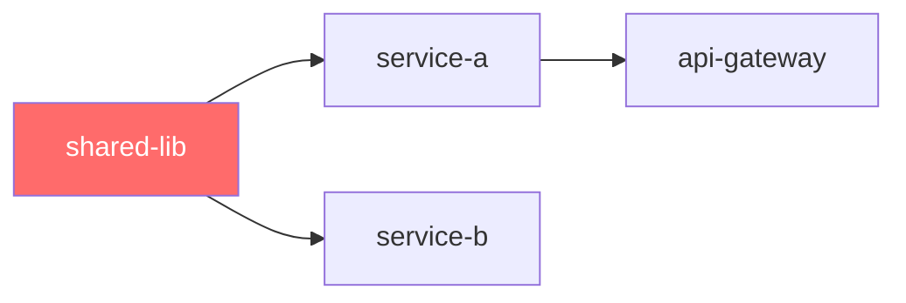

# Repo Graph Architect

Build a full, queryable **Hierarchical Dependency Graph** of a mono repo, then power
reverse-engineering Q&A on top of it.

## Two Modes of Operation

| Mode | When to use |
|---|---|
| **BUILD** | User gives you a repo path. Scan → parse → emit a graph file + interactive visualiser. |
| **QUERY** | A graph file already exists (`repo-graph.json`). Answer questions from the graph without re-scanning. |

If the user says "build", "scan", or provides a path → **BUILD mode**.  
If the user says "what depends on X" or asks a question without a new path → **QUERY mode** (load `repo-graph.json` first).

---

## Step 0 — Clarify with the User

Before scanning, confirm:

1. **Repo path** — absolute path to the mono-repo root.
2. **Language/build system** — or auto-detect (Maven, Gradle, npm, pip, etc.).
3. **Depth** — Module level only, or full class/file level too?  
   Default: **module + sub-module level** (fast, high-signal). File-level drill-down is on-demand.
4. **Output format** — Interactive HTML visualiser (default) + `repo-graph.json` (machine-readable).

---

## Step 1 — Reconnaissance

### 1a. Tree Survey

```bash
# Understand the top-level shape
find <repo_root> -maxdepth 2 -type f \
  \( -name "pom.xml" -o -name "build.gradle" -o -name "package.json" \
     -o -name "build.gradle.kts" -o -name "settings.gradle" \
     -o -name "settings.gradle.kts" -o -name "requirements.txt" \
     -o -name "pyproject.toml" -o -name "Cargo.toml" -o -name "go.mod" \) \
  | sort

# Count modules at each depth
find <repo_root> -name "pom.xml" | wc -l          # Maven module count
find <repo_root> -name "package.json" \
  | grep -v node_modules | wc -l                  # npm package count
```

### 1b. Detect Build System

| File found | Build system | Parser to use |
|---|---|---|
| `settings.gradle` or `settings.gradle.kts` | Gradle multi-project | `references/parsers/gradle.md` |
| Root `pom.xml` with `<modules>` | Maven multi-module | `references/parsers/maven.md` |
| Multiple `package.json` (non-node_modules) | npm/yarn workspaces | `references/parsers/npm.md` |
| `pyproject.toml` / `requirements.txt` | Python | `references/parsers/python.md` |
| Mixed | Multi-stack | Apply all relevant parsers |

**Read the relevant parser reference file** before proceeding.

---

## Step 2 — Build the Graph

A graph has three layers. Collect **all three** before drawing anything.

### Layer 1 — Structural Hierarchy (directory tree of modules)

```
repo-root
├── service-a          ← top-level module
│   ├── core           ← sub-module
│   └── api            ← sub-module
├── service-b
│   ├── domain
│   └── infra
└── shared-lib
```

For each node record:
```json
{
  "id": "service-a:core",
  "label": "core",
  "parent": "service-a",
  "type": "submodule",       // repo | module | submodule | package | class
  "path": "service-a/core",
  "buildFile": "service-a/core/pom.xml",
  "language": "java",
  "linesOfCode": 2400,
  "fileCount": 34
}
```

### Layer 2 — Declared Dependencies (from build files)

For each build file, extract `<dependency>`, `implementation`, `compile`, `require`, etc.

Record each edge:
```json
{
  "from": "service-a:core",
  "to": "shared-lib",
  "type": "compile",          // compile | test | runtime | optional | peer | dev
  "declaredIn": "service-a/core/pom.xml",
  "version": "2.1.0"
}
```

### Layer 3 — Implicit / Code-Level Dependencies (optional, on request)

If user wants file-level detail, scan source files:

```bash
# Java imports
grep -rn "^import " <module_path>/src --include="*.java" \
  | grep -v "java\.\|javax\.\|org\.junit\|org\.springframework" \
  | head -500

# Angular module imports
grep -rn "from '[.@]" <module_path>/src --include="*.ts" \
  | grep -v "node_modules" | head -500

# Python imports
grep -rn "^from \.\|^import \." <module_path> --include="*.py" | head -300
```

---

## Step 3 — Analyse the Graph

Run these analyses automatically. They become the Q&A knowledge base.

### 3a. Structural Metrics per Node

For each module/sub-module compute:

| Metric | Formula | Meaning |
|---|---|---|
| **Fan-out** | # of outgoing edges | How many things does this depend on? |
| **Fan-in** | # of incoming edges | How many things depend on this? |
| **Depth** | Distance from root in hierarchy | How nested is this? |
| **Instability** | fan-out / (fan-in + fan-out) | 0 = stable, 1 = unstable |
| **Abstractness** | (# interfaces + abstract classes) / total types | Only for code-level scan |

### 3b. Critical Path Analysis

Find nodes with **high fan-in** (many dependents). These are your blast-radius nodes — changing them is risky.

```
Top-5 most-depended-upon modules (highest fan-in):
1. shared-lib            (fan-in: 12)
2. common-utils          (fan-in: 9)
...
```

### 3c. Circular Dependency Detection

Run a DFS cycle detection across the dependency edges. Any cycle is a risk.

```bash
# Detect circular Maven dependencies (if graphviz available)
mvn dependency:tree -DoutputType=dot | grep -A 1000 "digraph"
```

For code-level cycle detection, use the script `scripts/cycle_detector.py`.

### 3d. Dead Module Detection

A module is potentially dead if:
- Fan-in = 0 (nothing depends on it), AND
- It is not a deployable entry-point (no `main()`, no Spring Boot `@SpringBootApplication`, no Angular `AppModule` / `main.ts`)

Flag these for review — they may be safe to delete.

### 3e. Change Impact Map

Pre-compute: "If module X changes, what else is at risk?"

For each module, its **impact set** = all nodes reachable via reverse-dependency traversal (i.e. follow edges *backwards*).

Store this in the graph JSON as `"impactSet": [...]` per node.

---

## Step 4 — Emit Outputs

### 4a. `repo-graph.json` — The Machine-Readable Graph

Save to the working directory. Structure:

```json
{
  "meta": {
    "repoRoot": "/path/to/repo",
    "generatedAt": "ISO-8601 timestamp",
    "buildSystem": "maven|gradle|npm|mixed",
    "totalModules": 42,
    "totalEdges": 87,
    "totalLinesOfCode": 280000
  },
  "nodes": [ { ...see Layer 1 schema above... } ],
  "edges": [ { ...see Layer 2 schema above... } ],
  "analysis": {
    "circularDependencies": [ ["a","b","a"] ],
    "deadModules": ["orphan-service"],
    "criticalNodes": [ { "id": "shared-lib", "fanIn": 12 } ],
    "impactMap": { "shared-lib": ["service-a", "service-b", ...] }
  }
}
```

### 4b. Interactive HTML Visualiser

Read `references/visualiser-template.md` for the full D3.js widget specification.

The visualiser must support:
- **Collapsible hierarchy tree** (left panel) — click to expand/collapse modules
- **Force-directed dependency graph** (centre) — nodes = modules, arrows = dependencies
- **Search bar** — type a module name to highlight it and its edges
- **Filters** — show/hide by: dependency type, depth level, dead modules, circular deps
- **Click a node** → right panel shows: metrics, dependents list, dependencies list, impact set
- **"Impact mode"** toggle — click a node to light up its entire blast radius in red

**Color coding:**
- 🔵 Blue = stable (fan-out 0, fan-in > 0)
- 🟢 Green = normal module
- 🟡 Yellow = high instability (instability > 0.7)
- 🔴 Red = circular dependency participant
- ⚫ Grey = dead module (fan-in 0, not entry-point)

---

## Step 5 — Answer Questions (QUERY Mode)

Load `repo-graph.json`, then answer questions using the graph data. Never hallucinate module names — only use what is in the graph.

### Question → Strategy mapping

| Question type | Strategy |
|---|---|
| "What depends on X?" | Look up `impactMap[X]` OR traverse edges where `to === X` |
| "What does X depend on?" | Traverse edges where `from === X` (recursive for transitive) |
| "Is there a path from X to Y?" | BFS/DFS from X, looking for Y |
| "What breaks if I delete X?" | Return `impactMap[X]` — these modules break |
| "Show me circular deps" | Return `analysis.circularDependencies` |
| "What are my dead modules?" | Return `analysis.deadModules` |
| "What is the most critical module?" | Return top of `analysis.criticalNodes` sorted by `fanIn` |
| "How stable is X?" | Return `instability` score from node metrics |
| "Which modules are in the blast radius of X?" | Return full `impactMap[X]` recursively expanded |
| "What changed between versions?" | Re-run BUILD mode and diff the two `repo-graph.json` files |
| "Where is feature Y implemented?" | Search node `label` and `path` fields; then grep source |
| "What modules does service A own?" | Filter nodes where `parent === "service-a"` |
| "Show me the dependency chain from A to B" | BFS and return the shortest path |

### Answer Format

Always structure answers as:

1. **Direct answer** — 1-2 sentences
2. **Graph evidence** — list the relevant nodes/edges from `repo-graph.json`
3. **Risk / insight** — what does this mean for the codebase?
4. **Visualise** — if helpful, produce an inline Mermaid diagram of the relevant sub-graph

---

## Step 6 — Inline Sub-Graph Diagrams

For Q&A responses, generate focused Mermaid diagrams of the relevant slice:



Rules:
- Never show the full graph inline — it will be unreadable. Max 15 nodes per diagram.
- Always highlight the query node in red.
- Use `-->` for compile deps, `-.->` for optional/test deps.

---

## Working with Very Large Repos (1000+ modules)

If `totalModules > 200`:
1. Only scan the top 3 hierarchy levels automatically.
2. Ask the user to pick **focus areas** (e.g. "scan everything under `payments/`").
3. Build a **summary graph** at the module level, not sub-module, for the first pass.
4. Offer drill-down: "Would you like me to expand the `payments` module in detail?"

If the full scan would take > 10 minutes, checkpoint: write partial `repo-graph.json` after each top-level module and tell the user.

---

## Quality Checklist

Before delivering the graph:

- [ ] Every module in the repo has a node in the graph
- [ ] All declared dependency edges are captured
- [ ] Circular dependencies flagged
- [ ] Dead modules flagged
- [ ] `impactMap` populated for every node
- [ ] HTML visualiser opens and renders without errors
- [ ] `repo-graph.json` is valid JSON
- [ ] Metrics (fan-in, fan-out, instability) computed for every node

---

## Reference Files

| File | Load when |
|---|---|
| `references/parsers/maven.md` | Maven multi-module repo |
| `references/parsers/gradle.md` | Gradle multi-project repo |
| `references/parsers/npm.md` | npm/yarn workspace repo |
| `references/parsers/python.md` | Python mono repo |
| `references/visualiser-template.md` | Building the HTML visualiser |
| `scripts/cycle_detector.py` | Running cycle detection programmatically |
| `scripts/graph_builder.py` | Building graph JSON from scanned data |
