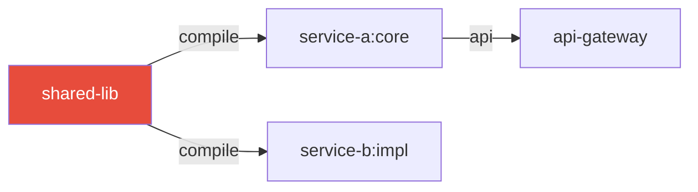

# Interactive Visualiser Specification

Build a single-file `repo-graph.html` that loads `repo-graph.json` (expected in the same
directory) and renders two synchronised panels.

## Technology Stack

- **D3.js v7** — force-directed graph + collapsible tree
- **No build step** — single self-contained HTML file
- CDN: `https://cdn.jsdelivr.net/npm/d3@7/dist/d3.min.js`

---

## Layout

```
┌─────────────────────────────────────────────────────────────┐
│  🔍 Search...  [Filters ▼]  [Impact Mode ○]  [Reset]        │
├──────────────────┬──────────────────────────┬───────────────┤
│  Hierarchy Tree  │   Force-Directed Graph    │  Node Detail  │
│  (collapsible)   │   (main canvas)           │  Panel        │
│                  │                           │               │
│  ▶ service-a     │    ●━━━▶●━━━▶●            │  Module: X    │
│    ▶ core        │         ╲                 │  Fan-in: 5    │
│    ▶ api         │          ▶●               │  Fan-out: 2   │
│  ▶ service-b     │                           │  Instability  │
│  ● shared-lib    │                           │  Impact set:  │
│                  │                           │  - svc-a      │
│                  │                           │  - svc-b      │
└──────────────────┴──────────────────────────┴───────────────┘
│ Stats: 42 modules | 87 edges | 2 circular deps | 3 dead modules │
└─────────────────────────────────────────────────────────────┘
```

---

## Node Color Scheme

Apply these CSS classes and colors:

```css
.node-stable     { fill: #4A90E2; }   /* high fan-in, low fan-out */
.node-normal     { fill: #27AE60; }   /* standard module          */
.node-unstable   { fill: #F39C12; }   /* instability > 0.7        */
.node-circular   { fill: #E74C3C; }   /* in a circular dep cycle  */
.node-dead       { fill: #95A5A6; }   /* fan-in = 0, not entry    */
.node-entry      { fill: #8E44AD; }   /* Spring Boot app / main() */
.node-highlighted{ fill: #FF6B35; stroke: #FF6B35; stroke-width: 3; }
.node-impact     { fill: #FFD93D; stroke: #F39C12; stroke-width: 2; }
```

---

## Core Features to Implement

### 1. Force-Directed Graph (D3 force simulation)

```javascript
const simulation = d3.forceSimulation(nodes)
  .force("link", d3.forceLink(edges).id(d => d.id).distance(80))
  .force("charge", d3.forceManyBody().strength(-300))
  .force("center", d3.forceCenter(width / 2, height / 2))
  .force("collision", d3.forceCollide().radius(20));
```

- Nodes are circles, radius proportional to `Math.sqrt(linesOfCode)` (min 8, max 30)
- Edges are arrows (`marker-end`) colored by type:
  - compile → dark grey `#555`
  - test → dashed blue `#3498DB`
  - api → bold orange `#E67E22`
  - optional → dashed grey
- Zoom + pan via `d3.zoom()`
- Drag nodes

### 2. Collapsible Hierarchy Tree (left panel)

Build from `nodes[].parent` relationships. Root = the repo root node.

On click → select that node and highlight it in the graph.
Expand/collapse children on double-click.

### 3. Search Bar

On input:
1. Filter tree to matching nodes (fuzzy match on `label` and `id`)
2. In the graph, dim all non-matching nodes to opacity 0.1
3. Highlight matching nodes

### 4. Filter Panel (dropdown)

Checkboxes:
- ☑ Show compile deps
- ☑ Show test deps
- ☑ Show runtime deps
- ☐ Show external deps (off by default)
- ☑ Show dead modules
- ☑ Show circular dep nodes

### 5. Impact Mode Toggle

When Impact Mode is ON:
- Click any node → its full impact set lights up yellow (`node-impact`)
- The clicked node turns orange (`node-highlighted`)
- A banner appears: "Changing **X** puts **N** modules at risk"

### 6. Node Detail Panel (right panel)

On node click, show:
```
Module:      service-a:core
Path:        service-a/core
Type:        submodule
Language:    java
LOC:         2,400
Files:       34

Metrics:
  Fan-in:    3
  Fan-out:   5
  Instability: 0.63  [████████░░] moderate

Dependencies (5):
  → shared-lib        [compile]
  → common-utils      [compile]
  → test-fixtures     [test]
  ...

Depended on by (3):
  ← service-a:api
  ← service-b:impl
  ← api-gateway

Impact Set (8 modules):
  service-a:api, service-b:impl, api-gateway ...
```

### 7. Summary Footer

```
42 modules | 87 edges | 2 circular dependency cycles | 3 dead modules
Most critical: shared-lib (12 dependents)
```

---

## HTML Skeleton

```html
<!DOCTYPE html>
<html lang="en">
<head>
  <meta charset="UTF-8">
  <title>Repo Graph — {REPO_NAME}</title>
  <script src="https://cdn.jsdelivr.net/npm/d3@7/dist/d3.min.js"></script>
  <style>/* embed all CSS here */</style>
</head>
<body>
  <header><!-- search + filters + controls --></header>
  <main>
    <aside id="tree-panel"><!-- collapsible tree --></aside>
    <section id="graph-canvas"><!-- D3 SVG --></section>
    <aside id="detail-panel"><!-- node details --></aside>
  </main>
  <footer id="stats-bar"><!-- summary stats --></footer>
  <script>
    // 1. Fetch repo-graph.json
    // 2. Build D3 simulation
    // 3. Render tree
    // 4. Wire up events
  </script>
</body>
</html>
```

---

## Loading repo-graph.json

```javascript
// Embed the JSON inline to avoid CORS on file:// protocol
// At build time, inline the JSON directly into the HTML:
const GRAPH_DATA = /* INJECT_GRAPH_JSON_HERE */;

// OR if serving over http:
fetch('./repo-graph.json')
  .then(r => r.json())
  .then(data => init(data));
```

**IMPORTANT**: When generating the HTML file, embed the JSON directly as a JavaScript
constant so the file works when opened from the filesystem without a web server.

---

## Mermaid Inline Diagrams (for Q&A responses)

When answering questions in chat (not the HTML file), use Mermaid:



Max 15 nodes. Highlight the focal node in red.
