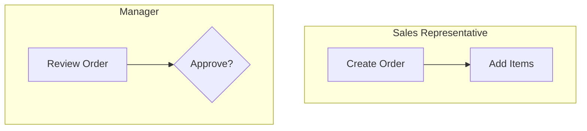
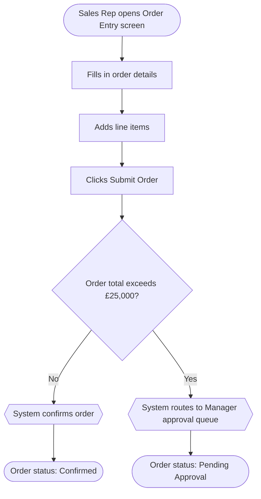
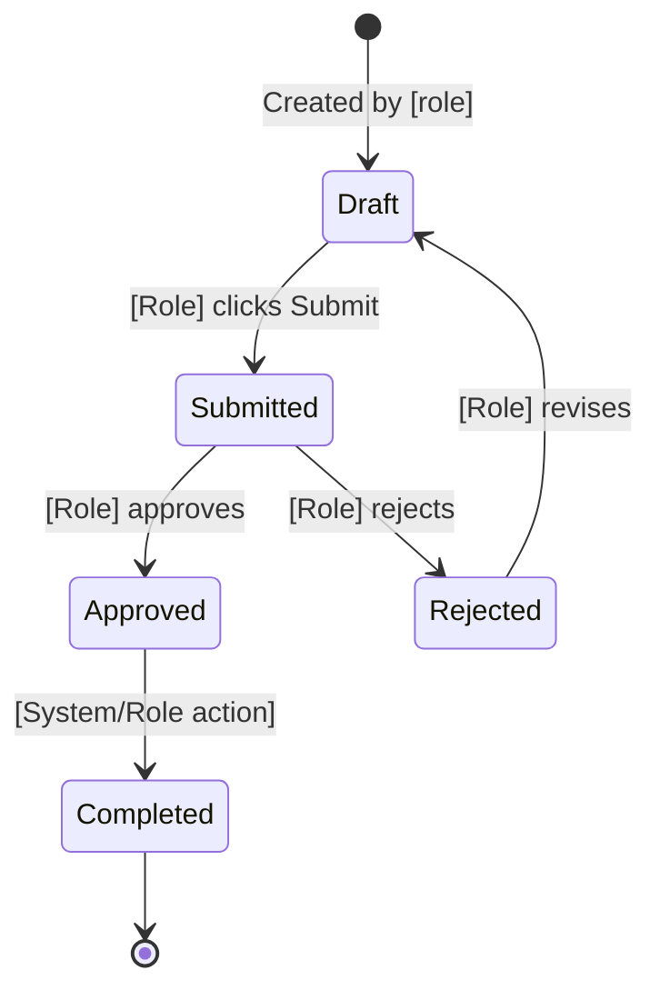
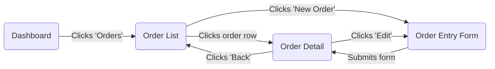
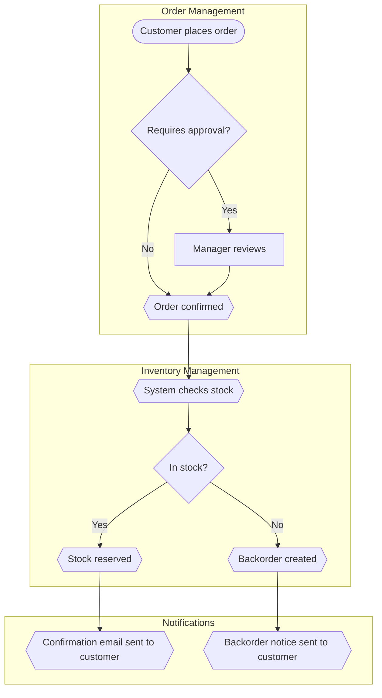
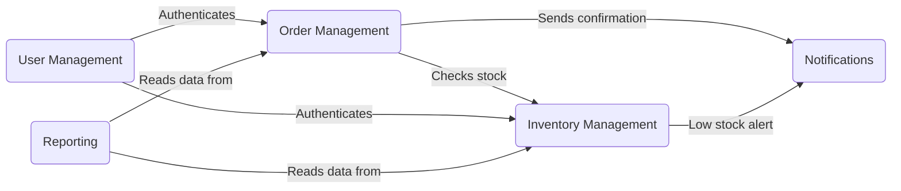

# Mermaid Diagram Conventions

How to generate flow diagrams for functional specifications. Every diagram must be traceable to code — never invent steps, states, or transitions.

---

## Table of Contents

1. [Diagram Types](#1-diagram-types)
2. [Zero Hallucination Rule for Diagrams](#2-zero-hallucination-rule-for-diagrams)
3. [Mermaid Syntax Standards](#3-mermaid-syntax-standards)
4. [User Workflow Diagrams](#4-user-workflow-diagrams)
5. [Entity State Lifecycle Diagrams](#5-entity-state-lifecycle-diagrams)
6. [Screen Navigation Diagrams](#6-screen-navigation-diagrams)
7. [System-Level Diagrams](#7-system-level-diagrams)
8. [Naming and ID Conventions](#8-naming-and-id-conventions)

---

## 1. Diagram Types

| Diagram Type | Mermaid Type | When to Generate | Source in Code |
|---|---|---|---|
| User Workflow | `flowchart TD` | One per major user workflow in the module | Controllers + service call chains + frontend navigation |
| Entity State Lifecycle | `stateDiagram-v2` | One per entity that has status/state transitions | Enum definitions + service methods that change state |
| Screen Navigation | `flowchart LR` | One per module showing screen-to-screen flow | Route definitions + `routerLink` targets + navigation guards |
| End-to-End Journey (system-level) | `flowchart TD` | Major workflows crossing module boundaries | Cross-service calls (Feign, Kafka, etc.) |
| Auth Flow (system-level) | `flowchart TD` | Login, session, role-routing | Security config + auth guards + interceptors |
| Module Interaction (system-level) | `flowchart LR` | How modules communicate | Feign clients + message queues + shared events |

---

## 2. Zero Hallucination Rule for Diagrams

The anti-hallucination rule applies to diagrams with full force:

> **Every node, edge, and label in a diagram must trace to something you observed in the code.** If you cannot point to the source, do not draw it.

**You CAN draw:**
- A state transition `Draft --> Submitted` → because you saw `enum OrderStatus { DRAFT, SUBMITTED }` and a method `submitOrder()` that changes status
- A screen navigation `Order List --> Order Detail` → because you saw `routerLink="/orders/:id"` in the list template
- A workflow step `User clicks Submit --> System validates` → because you saw a form submit handler calling a validation service

**You CANNOT draw:**
- A notification step `System sends email` → unless you found an email send call in that flow
- A decision diamond `Is user premium?` → unless you found that conditional in the service logic
- A screen `Reports Dashboard` → unless you found that route/component in the code

**Partial flows:** If you can trace steps 1-3 of a workflow but step 4 is unclear, draw steps 1-3 and add a comment:
```
%% Partial flow — what happens after manager approval could not be traced in code
```

**Ask rather than guess:** If a critical flow cannot be fully traced, note it and ask the user:
"I can see the order submission flow up to the approval step, but I cannot determine from the code what happens after a manager approves. Can you describe the post-approval process?"

---

## 3. Mermaid Syntax Standards

### General rules

- Use `flowchart TD` (top-down) for workflows and journeys
- Use `flowchart LR` (left-right) for navigation and interactions
- Use `stateDiagram-v2` for entity lifecycles
- All node labels must be in **plain English** — no code references, no class names
- Wrap the diagram in a fenced code block with `mermaid` language tag
- Add a title comment at the top: `%% FLOW-[MOD]-001: [Descriptive Title]`
- Keep diagrams readable: maximum ~15 nodes per diagram. Split large flows into multiple diagrams.

### Node shapes

| Shape | Syntax | Use for |
|---|---|---|
| Rectangle | `[User action]` | Standard steps |
| Rounded | `(Screen name)` | Screens/pages |
| Diamond | `{Decision?}` | Business rule decisions |
| Stadium | `([Start/End])` | Entry and exit points |
| Hexagon | `{{System action}}` | Automated system behaviour |

### Edge labels

- Always label edges that represent user actions: `-->|Clicks Submit|`
- Always label decision branches: `-->|Yes|` / `-->|No|`
- Do not label edges that are simple sequential flow (implicit "then")

### Subgraphs

Use subgraphs to group by role or module:


---

## 4. User Workflow Diagrams

One per major user workflow discovered in the module.

### How to discover workflows

1. Find controller methods that represent the entry point of a process
2. Trace the service calls to understand the sequence
3. Check for conditional branching (business rules that fork the flow)
4. Check for state changes (what happens to the entity at each step)
5. Check the frontend for the screens/forms involved at each step

### Template

```markdown
### [Workflow Name] Flow

**Trigger:** [What starts this workflow]
**Actors:** [Which roles are involved]
**Source:** [Which controller/service/component you traced this from — for internal reference only, do NOT include in the actual spec output]

` ` `mermaid
%% FLOW-[MOD]-001: [Workflow Name]
flowchart TD
    A([User starts action]) --> B[Step 1: description]
    B --> C{Business rule decision?}
    C -->|Condition met| D[Step 2a: description]
    C -->|Condition not met| E[Step 2b: description]
    D --> F{{System performs action}}
    F --> G([Flow complete])
` ` `
```

(Remove spaces from the triple backtick fences when generating actual output.)

### Example: Order Submission Workflow



---

## 5. Entity State Lifecycle Diagrams

One per entity that has status/state transitions.

### How to discover lifecycles

1. Find enum definitions that represent states (e.g., `OrderStatus`, `TicketState`)
2. Find service methods that transition between states
3. Check for guards/conditions on transitions
4. Check which roles can trigger each transition

### Template



### Rules

- Every state must correspond to an enum value or status field found in the code
- Every transition must correspond to a method or action found in the code
- Label transitions with **who** triggers them and **what** they do
- Include the `[*]` start and end markers

---

## 6. Screen Navigation Diagrams

One per module showing how screens connect.

### How to discover navigation

1. Read route definitions — each route = one screen node
2. Read `routerLink` directives in templates — each link = one edge
3. Check navigation guards — add role annotations
4. Check redirects and post-action navigation (e.g., "after submit, navigate to list")

### Template



### Rules

- Use rounded nodes `(Screen Name)` for all screens
- Label edges with the user action that triggers navigation
- Show role restrictions as annotations: `(Admin Dashboard):::admin`
- Show guarded routes with a note: `%% Requires: Manager role`

---

## 7. System-Level Diagrams

These go in `system/06-system-flow-diagrams.md`.

### End-to-End User Journey

Flows that cross module boundaries. Use subgraphs per module:



### Module Interaction Map

Shows which modules communicate:



---

## 8. Naming and ID Conventions

| Diagram Type | ID Format | Example |
|---|---|---|
| User Workflow (module) | `FLOW-[MOD]-NNN` | `FLOW-ORD-001` |
| State Lifecycle (module) | `STATE-[MOD]-NNN` | `STATE-ORD-001` |
| Screen Navigation (module) | `NAV-[MOD]-NNN` | `NAV-ORD-001` |
| System End-to-End | `SYS-FLOW-NNN` | `SYS-FLOW-001` |
| System Module Map | `SYS-MAP-NNN` | `SYS-MAP-001` |
| System Auth Flow | `SYS-AUTH-NNN` | `SYS-AUTH-001` |

---

## Updating Diagrams (for spec-updater)

When requirements change existing flows:

1. **Reproduce the current diagram** from the existing spec's `06-flow-diagrams.md`
2. **Show the proposed change** as a new diagram with the modifications highlighted using comments:
   ```
   %% CHANGED: Added director approval step after manager approval
   ```
3. **Never modify a diagram in a way that cannot be traced** to the requirement
4. **If a requirement adds a step to a flow**, only add that step — do not reorganise the entire diagram
5. **If a requirement creates a new flow**, generate a new diagram following the conventions above
