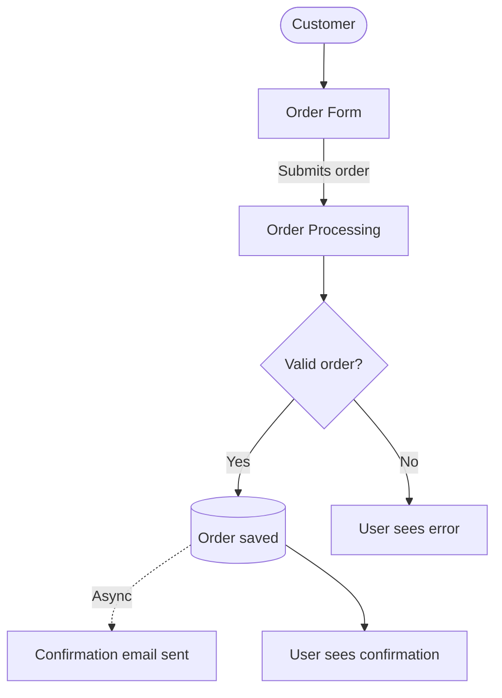
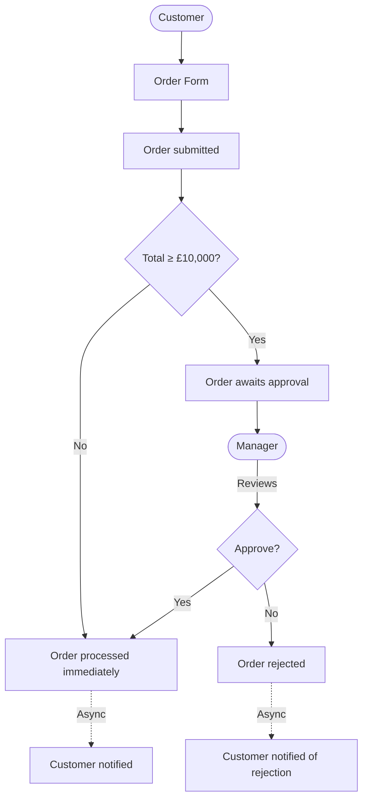
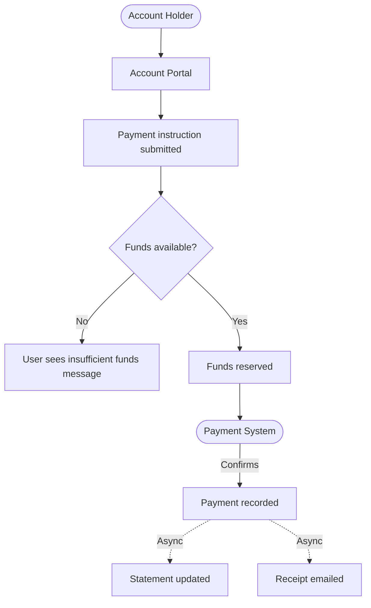
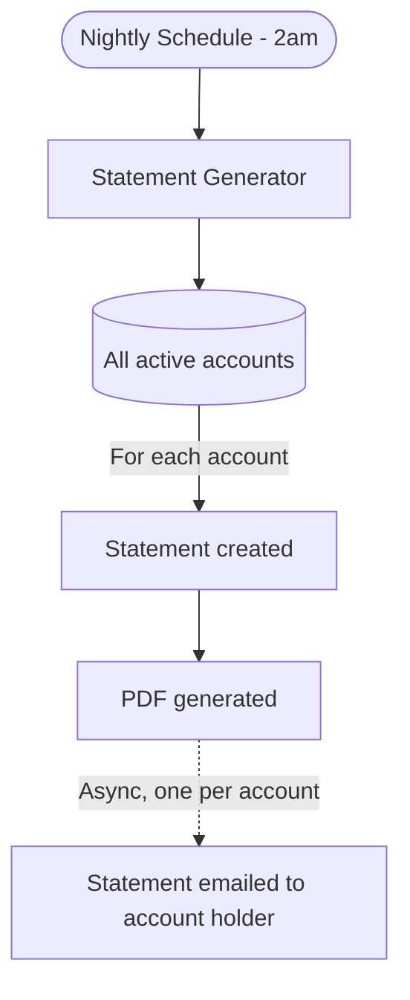
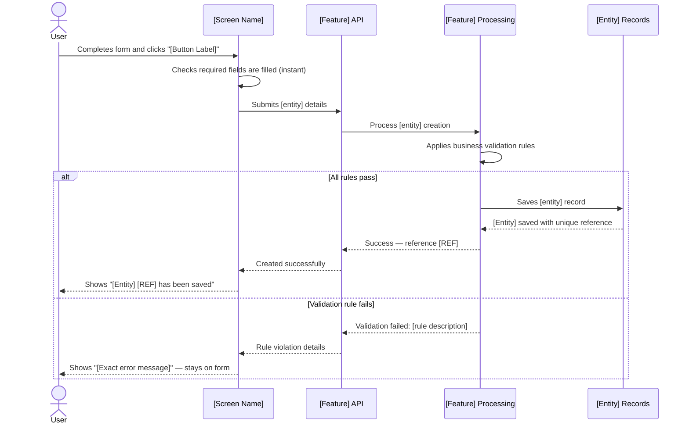
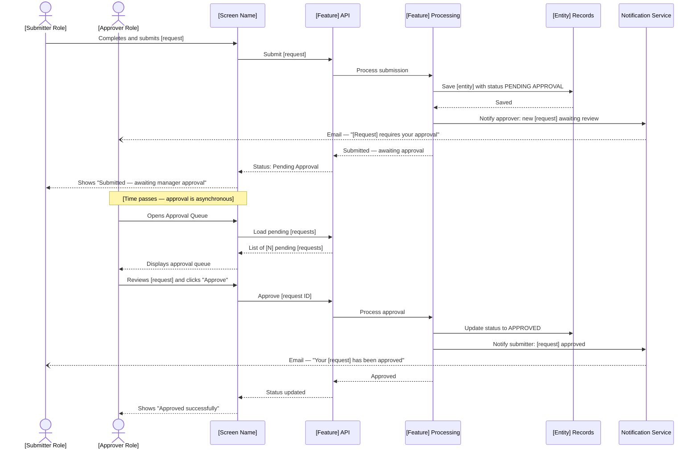
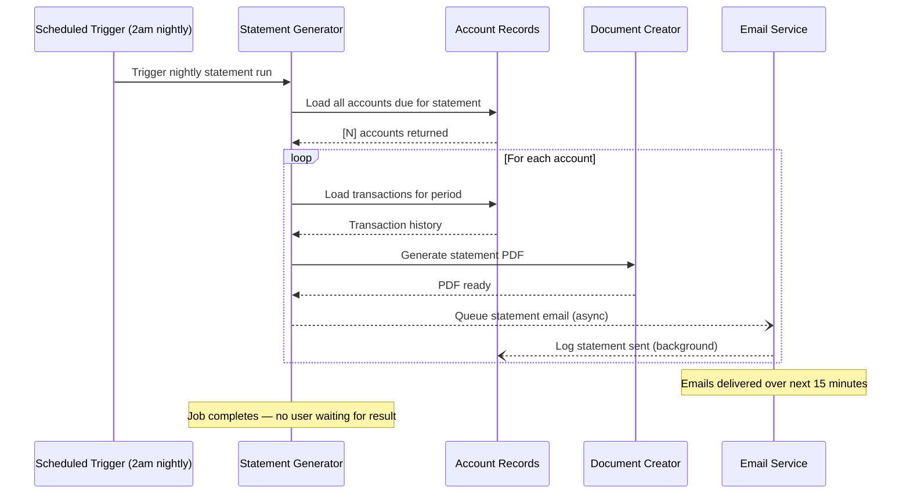
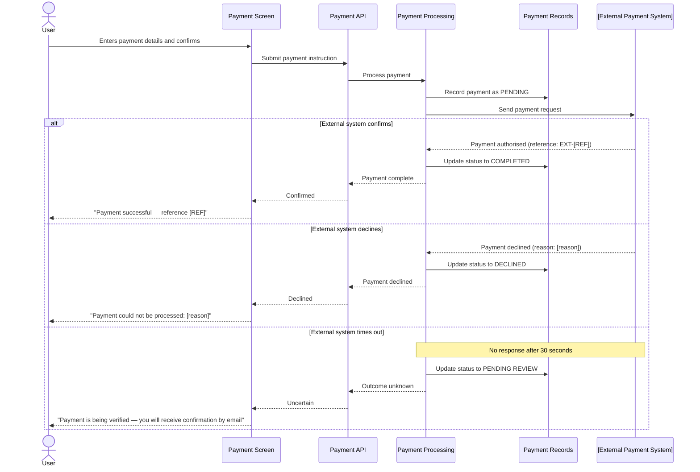

# Flow Extraction Reference

Detailed patterns for tracing front-to-back flows and generating
Section 4A (high-level overview) and Section 4B (detailed breakdowns).

---

## What Is a Flow?

A flow is the complete journey of ONE user intention from first click to final
outcome — tracing through every layer of the system.

Unlike a use case (which describes steps from the user's perspective only),
a flow traces what EVERY layer does:

```
User clicks button
  → Angular component handles event
    → Angular service makes HTTP call
      → Java controller receives request
        → Java service applies business rules
          → Repository reads/writes data
            → Event published (if async)
              → Consumer processes event
                → External system notified
                  → Response travels back up
                    → Angular updates UI
                      → User sees result
```

---

## Flow Discovery: What to Look For

### Signal 1: Angular Button Click → Service Call
```
(click)="submit()" in template
→ component.submit() method
→ this.orderService.createOrder(data)
→ HTTP POST /api/orders
```

### Signal 2: Angular Route → Page Load
```
Route guard resolves → component initialised
→ ngOnInit() calls this.service.getData()
→ HTTP GET /api/[resource]
```

### Signal 3: Java Controller → Service → Repository
```
@PostMapping → @Service method → @Repository.save()
```

### Signal 4: Service → Event → Consumer (async)
```
orderService.process() → applicationEventPublisher.publishEvent(OrderCreatedEvent)
→ @EventListener in NotificationService → sends email
```

### Signal 5: Scheduled Trigger
```
@Scheduled(cron="0 0 2 * * *") → statementService.generate()
→ reads all accounts → generates PDF → sends email
```

### Signal 6: External Integration
```
Service → restTemplate.post("https://payment-gateway.com/charge")
→ external processes payment → returns result
```

---

## How to Name Flows

Name every flow from the USER's perspective, using the verb they would use.
The name should answer "what is the user trying to accomplish?"

| Technical description | Business flow name |
|---|---|
| POST /api/orders → save to DB | Submit a Purchase Order |
| GET /api/orders/{id} → return DTO | View Order Details |
| PUT /api/orders/{id}/status → APPROVED | Approve an Order |
| @Scheduled → generate report | Generate Nightly Account Statements |
| POST /api/customers → save → publish event | Register a New Customer |

---

## Master Flowchart Patterns (Section 4A)

### Pattern: Linear flow (simple feature)



### Pattern: Approval chain



### Pattern: Multi-system integration



### Pattern: Scheduled / background



---

## Sequence Diagram Patterns (Section 4B)

### Pattern: Simple CRUD with validation



### Pattern: Approval workflow



### Pattern: Async background process



### Pattern: External system integration



---

## Diagram Label Translations

Always translate technical terms to business language in diagram labels:

| Technical label | Business label |
|---|---|
| `POST /api/orders` | "Submits order details" |
| `orderRepository.save(entity)` | "Saves order record" |
| `kafkaTemplate.send("order-events", event)` | "Notifies fulfilment system" |
| `OrderStatus.PENDING_APPROVAL` | "Awaiting manager approval" |
| `restTemplate.post(paymentGatewayUrl)` | "Sends payment to [Gateway Name]" |
| `@Scheduled(cron="0 0 2 * * *")` | "Nightly at 2am" |
| `applicationEventPublisher.publishEvent(e)` | "Triggers background notification" |
| `Optional.empty()` | "Record not found" |
| `throw new BusinessException("...")` | "Rejected: [plain English reason]" |
