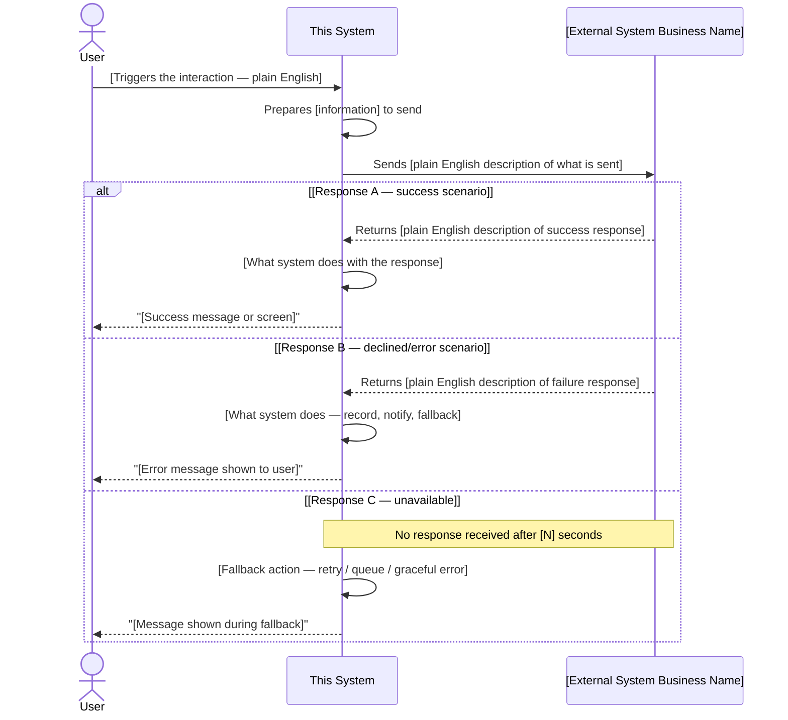
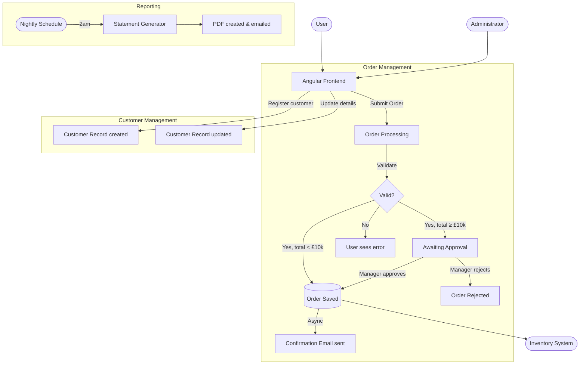
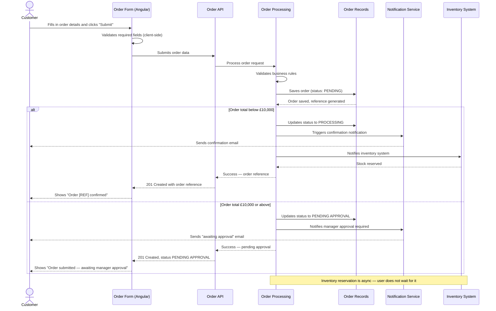

# Functional Requirements Document — Output Template

Follow this structure exactly. Every section must appear. Write "Not applicable — [reason]"
only if a section genuinely has no content after thorough code analysis.

---

## COVER PAGE

```
FUNCTIONAL REQUIREMENTS DOCUMENT

System Name:   [Business name of the system]
Version:       1.0 — Draft
Date:          [Today's date]
Prepared by:   AI-assisted analysis — requires human review and sign-off
Reviewed by:   [Leave blank]
Approved by:   [Leave blank]
```

---

## DOCUMENT CONTROL

| Version | Date | Changed by | Change Description |
|---------|------|------------|--------------------|
| 1.0 | [Date] | AI-assisted | Initial FRD generated from codebase analysis |

---

## TABLE OF CONTENTS

(Auto-generated from headings)

---

# 1. Introduction & Purpose

## 1.1 What is this system?

Write 1 paragraph. One sentence on what the system is. One sentence on who it is for.
One sentence on the primary problem it solves.

**Tone**: "A new product owner walking in on their first day would read this and
immediately understand what this system is for."

Example paragraph:
> The [System Name] is a web-based platform used by [primary user group] to [primary
> function]. It enables [organisation name] to [key business capability] without
> [the problem it replaces or removes]. The system serves [X] distinct user types
> and covers [N] major functional areas.

## 1.2 Business Problem Solved

1–2 paragraphs. What was difficult or impossible before this system existed?
What manual process does it replace or support? What business outcome does it enable?

## 1.3 Who Uses This System?

One sentence listing each user type (not technical role names — business names).
Example: "The system is used by Customer Service Agents, Operations Managers,
Finance Approvers, and System Administrators."

---

# 2. Project Scope

## 2.1 In Scope

Everything the system currently does, grouped by functional area. One bullet per
capability group. Write these as plain English statements of capability.

- **[Functional Area]:** [List of capabilities as a comma-separated sentence]
- **[Functional Area]:** [List of capabilities]

Example:
- **Customer Management:** Creating new customer accounts, editing customer details,
  viewing account history, and suspending or reactivating accounts
- **Order Processing:** Creating, editing, submitting, and cancelling orders; tracking
  order status through its full lifecycle; viewing order history

## 2.2 Out of Scope

Explicitly state what the system does NOT do. This is as important as what it does do.
Infer from absence in code — if it isn't there, it's out of scope.

Write at minimum 3–5 items. Examples:
- The system does not process payments directly; payment status is updated manually
  or by an external system
- The system does not provide mobile-specific layouts; it is designed for desktop use
- There is no built-in reporting dashboard; data export is available for external analysis
- The system does not manage [X] — this is handled by [external system/process]

---

# 3. User Roles & Personas

## 3.1 Roles Summary

| Role Name | Description | Access Level | Key Permissions |
|-----------|-------------|--------------|-----------------|
| [Business role name] | [1-sentence description of who this person is] | Full / Limited / Read-only | [Comma-separated list of what they can do] |

**Note**: Use business role names, not technical names.
Map: `ROLE_ADMIN` → "System Administrator" | `ROLE_USER` → "Standard User" |
`ROLE_MANAGER` → "Manager" | `ROLE_READ_ONLY` → "Viewer"

## 3.2 Role Personas

For each role, write 2–3 sentences describing a typical person in that role.

**[Role Name]**
> [Name a typical person, e.g. "Sarah is a Customer Service Agent..."] She uses the
> system [how frequently] to [primary tasks]. Her most common actions are [top 3 things
> she does]. She needs to [key goal] without [key friction point she experiences].

---

# 4. User Stories & Use Cases

## 4.1 User Stories

Group by module/functional area. Write one per distinct user action.

**Format**: *As a [role], I want to [action] so that [benefit].*

### [Module Name]
- As a [role], I want to [action] so that [benefit].
- As a [role], I want to [action] so that [benefit].

*(Repeat for every module)*

## 4.2 Use Cases

Write a full use case for every significant multi-step workflow.
Minor CRUD operations (view a list, edit a single field) do not need full use cases.

### UC-[MOD]-[###]: [Use Case Name]

| Field | Detail |
|---|---|
| **Actor** | [Role name] |
| **Goal** | [One sentence — what they are trying to accomplish] |
| **Preconditions** | [What must be true before this starts] |
| **Trigger** | [What causes the user to start this] |

**Main Flow** (what happens when everything goes right):

1. The [role] navigates to [screen name — business name].
2. The system displays [what they see].
3. The [role] [action — fills in / selects / clicks].
4. The system [validates / checks / processes].
5. The system [result — saves / sends / displays].
6. The system displays [success confirmation message or next screen].

**Alternate Flows** (what can go wrong or differ):

- **4a** — If a required field is empty: The system highlights the field in red and
  displays "[exact or close wording of error message]." The user corrects the field
  and resubmits.
- **4b** — If [business rule fires]: The system displays "[message]." The user
  [resolution].
- **2a** — If the user does not have permission: The system redirects to the home page
  and displays "You do not have permission to access this page."

**Postcondition**: [What is now true after successful completion]

*(Repeat for every significant workflow)*

---

# 5. Functional Requirements

One FR statement per feature. Numbered for traceability.

**Format**: **FR-[MOD]-[###]**: The system **shall** [action] [condition/trigger].

Group by module:

## FR: [Module Name]

| Requirement ID | The system shall... |
|---|---|
| **FR-[MOD]-001** | [Observable action] [when/if condition]. |
| **FR-[MOD]-002** | [Observable action] [when/if condition]. |

**Writing rules**:
- "The system shall" starts every statement — never "The user shall"
- Describe the result the user experiences — not how the system achieves it
- Every statement must be independently testable by QA
- Use only "shall" / "must" — never "should", "may", "could"

**Examples of good FR statements**:
- The system **shall** display the order reference number on a confirmation screen
  immediately after an order is successfully submitted.
- The system **shall** prevent submission of a form if any field marked as mandatory
  is empty, and shall highlight each empty mandatory field in red.
- The system **shall** lock a user account after 5 consecutive failed login attempts
  and display a message directing the user to contact an administrator.
- The system **shall** automatically sign out users who have been inactive for
  30 consecutive minutes and shall display a session-expiry notification.

---

# 6. UI/UX — Screens & Navigation

## 6.1 Navigation Structure

Describe the main menu and navigation hierarchy as the user experiences it.

**Main navigation items** (as labelled in the application):
- [Menu item 1] → leads to [screen/section]
- [Menu item 2] → leads to [screen/section]

**Navigation varies by role**:
- [Role A] sees: [list of menu items]
- [Role B] sees: [list of menu items]

## 6.2 Screen Descriptions

One entry per screen/page in the application.

### [Screen Business Name]

| Field | Detail |
|---|---|
| **Access** | [Which roles can reach this screen] |
| **Purpose** | [One sentence — what the user accomplishes here] |
| **How to get here** | [Previous screen or menu item] |
| **Where to go next** | [After completing the primary action] |

**What the user sees**:
- [Describe the main sections or panels visible on the page]
- [List form fields with their labels exactly as shown to the user]
- [Describe tables with column headings as shown]
- [List buttons with their labels]
- [Note any read-only information panels]
- [Note any filters, search bars, or sorting options]

**Key interactions**:
- When the user clicks "[Button label]": [describe what happens]
- When the user types in the search bar: [describe result]
- When the user selects a row in the table: [describe what opens]
- Before [destructive action]: The system asks the user to confirm with the message
  "[confirmation message wording]"

*(Repeat for every screen in the application)*

---

# 7. Data Requirements

## 7.1 Data Entities

For each major piece of information the system manages, document what it captures.

### [Entity Plain English Name, e.g. "Customer Record"]

**Purpose**: [What this information is used for, in one sentence]

| Field Name | Required | Format | Allowed Values | Example |
|------------|----------|--------|----------------|---------|
| [Plain English name] | Yes / No | [Text max 100 chars / Date / Whole number / Decimal / Yes-No / Selection] | [Any / list of options] | [Example value] |

**Notes**: [Any important rules about this data as a whole, e.g. "Only one active
record per customer is permitted."]

*(Repeat for every entity)*

## 7.2 Data Display Rules

Where the system shows calculated or derived information to the user:

| Displayed Value | How It Appears | Notes |
|---|---|---|
| [What the user sees] | [How it is formatted/presented] | [Any conditions on display] |

---

# 8. Business Rules

## 8.1 Rules by Module

### [Module Name]

| Rule ID | Rule | Condition | What the User Experiences | How to Test |
|---------|------|-----------|---------------------------|-------------|
| **BR-[MOD]-001** | [Plain English statement] | [When does this apply?] | [What the user sees/can't do] | [Test scenario] |

**Examples of well-written business rules**:

| Rule ID | Rule | Condition | What the User Experiences | How to Test |
|---|---|---|---|---|
| BR-ORD-001 | An order cannot be submitted if its total value is zero | User clicks "Submit Order" | System displays: "Order must contain at least one item with a quantity greater than zero." | Create an order with no items and click Submit |
| BR-ORD-002 | Orders exceeding £10,000 require manager approval before processing | Order total exceeds £10,000 | Order status changes to "Pending Approval" and the manager receives an email notification | Submit an order for £10,001 |
| BR-USR-001 | A user cannot be assigned a role higher than the role of the user making the change | Admin attempts to assign a role | Roles higher than the current user's own level are shown as disabled | Log in as Supervisor and attempt to assign Administrator role |

## 8.2 Status Lifecycle Rules

For each entity that has a status or state:

### [Entity Name] Status Lifecycle

```
[Status A] → [Status B] → [Status C]
                ↓
           [Status D]
```

| From Status | To Status | Who Can Change It | Condition |
|---|---|---|---|
| [Status A] | [Status B] | [Role] | [When/why] |

---

# 9. Error Handling

## 9.1 Validation Errors (Missing or Invalid Input)

| Scenario | Field(s) Affected | Message Shown to User | Resolution |
|---|---|---|---|
| [Plain English description] | [Field name as shown in UI] | "[Exact or close wording]" | [What the user should do] |

## 9.2 Permission Errors

| Scenario | Message Shown to User | Resolution |
|---|---|---|
| User tries to access a page they cannot see | "You do not have permission to access this page." | Contact an administrator |
| User tries to perform an action they cannot do | "[Specific message if different]" | [Resolution] |

## 9.3 Business Rule Violations

| Scenario (business rule that fired) | Message Shown to User | Resolution |
|---|---|---|
| [Plain English of the rule that was violated] | "[Message]" | [What to do] |

## 9.4 System & Connectivity Errors

| Scenario | Message Shown to User | Resolution |
|---|---|---|
| The system cannot complete a request due to a temporary problem | "[Message wording]" | [e.g. "Wait and try again"] |
| The user's session has expired | "[Session expiry message]" | Log back in |
| A record the user is looking for does not exist | "[Not found message]" | [Resolution] |
| The user tries to create something that already exists | "[Duplicate message]" | [Resolution] |

---

# 10. Assumptions & Constraints

## 10.1 Assumptions

Things inferred from the code that must be confirmed by a stakeholder before the FRD
is treated as final.

| ID | Assumption | Confidence | Requires Validation |
|----|-----------|------------|---------------------|
| A-001 | [What was assumed] | High / Medium / Low | Yes / No |

## 10.2 Constraints

Limitations discovered in the code that affect what users can do.

| ID | Constraint | Impact on Users |
|----|-----------|-----------------|
| C-001 | The system supports the English language only | Users who require other languages are not served |
| C-002 | [File upload limit, if found in config] | Users cannot upload files larger than [X] MB |
| C-003 | [Session timeout, if found] | Users are automatically signed out after [N] minutes of inactivity |

## 10.3 External Dependencies

High-level list of all external systems this module relies on.
Full interaction details (what is sent, what comes back, what happens next)
are documented in **Section 13 — External System Interactions**.

| External System | What This System Relies on It For | Section 13 Reference |
|---|---|---|
| [Business name of system] | [One sentence — what capability it provides] | EXT-[###] |

---

# 11. Glossary

Business and domain terms used in this document that a new team member may not know.

| Term | Definition |
|---|---|
| [Term as used in the system] | [Plain English definition] |

---

# 12. Appendix: Feature-to-Screen Map

Quick reference: what can I do, and where?

| What the user can do | Screen name | Section reference | Who can do it |
|---|---|---|---|
| [Feature description] | [Screen business name] | FR-[MOD]-[###] | [Role(s)] |

---

# 13. External System Interactions

This section documents every interaction with a system outside the current module —
what triggers the interaction, what information is sent, what comes back, and what
the system does with that response. Written entirely in business language.

**Purpose**: A product owner or business analyst can read this section to understand
every external dependency without reading any code or API documentation.

---

## 13.1 External System Inventory

| ID | External System | Business Purpose | Interaction Type | Called From | Response Timing |
|---|---|---|---|---|---|
| EXT-001 | [System name] | [Why we need it] | [Request/Response / Event / File transfer] | [Feature or flow that triggers it] | [Immediate / Async within Xmin / Batch nightly] |

**Interaction types:**
- **Request/Response** — system sends a request and waits for a reply before continuing
- **Event notification** — system tells external system something happened (fire and forget)
- **File transfer** — system sends or receives a file (batch, scheduled)
- **Webhook / inbound** — external system calls this system when something happens

---

## 13.2 Detailed Interaction Specifications

One subsection per external system. One entry per distinct interaction with that system.

---

### EXT-[###]: [External System Business Name]

**What this system is**: [2-sentence plain English description of what the external system does]
**Owned by**: [Team / Third-party provider / Vendor name]
**Criticality**: [Critical (system cannot function without it) / Important (degraded without it) / Optional (enhances but not required)]

---

#### Interaction [###].1 — [Plain English name of this specific interaction]

**Triggered when**: [What user action or system event causes this interaction to happen]
**Which flow uses this**: [F-[###] from Section 4A — flow name]
**Interaction direction**: [Outbound — this system calls external / Inbound — external system calls us]

##### What This System Sends

| Information Sent | Business Meaning | Required / Optional | Example Value |
|---|---|---|---|
| [Plain English field name] | [Why the external system needs this] | Required | [Realistic example] |
| [Plain English field name] | [Why the external system needs this] | Optional | [Realistic example] |

*Plain English description of the overall request in one sentence:*
"The system sends the customer's [details] to [external system] to [purpose]."

##### What the External System Returns

The external system can respond in [N] ways:

**Response A — [Business name for this outcome, e.g. "Payment Authorised"]**

| Information Returned | Business Meaning | Always Present |
|---|---|---|
| [Plain English field name] | [What this tells our system] | Yes / No |
| [Plain English field name] | [What this tells our system] | Yes / No |

**Response B — [Business name, e.g. "Payment Declined"]**

| Information Returned | Business Meaning | Always Present |
|---|---|---|
| [Plain English field name] | [What this tells our system] | Yes / No |
| [Decline reason] | [Human-readable reason for the decline] | Yes |

**Response C — [Business name, e.g. "External System Unavailable"]**
*(No data returned — connection failed or timed out)*

##### What This System Does With Each Response

| Response Received | System Action | What the User Sees | Data Recorded |
|---|---|---|---|
| [Response A — success] | [What the system does next — in plain English, no code] | "[Exact message or screen the user sees]" | [What is saved/updated as a result] |
| [Response B — declined] | [What the system does] | "[Message shown to user]" | [What is recorded] |
| [Response C — unavailable] | [Fallback behaviour — retry? queue? graceful error?] | "[Message shown to user]" | [e.g. "Interaction logged as 'pending retry'"] |

##### Timing and Reliability

| Property | Value | Business Impact |
|---|---|---|
| How long the user waits | [e.g. "Up to 10 seconds — user sees a 'Processing...' indicator"] | [What this means for user experience] |
| What happens if it times out | [e.g. "System retries once after 5 seconds, then shows error"] | [User experience during failure] |
| What happens if it is completely unavailable | [e.g. "System queues the request and retries every 15 minutes"] | [Can users continue? Is data at risk?] |
| Retry behaviour | [e.g. "Retries up to 3 times with 30-second gaps"] | [How this prevents data loss] |

##### Interaction Sequence Diagram



---

*(Repeat the above block for every distinct interaction with [External System])*

*(Add a new ### EXT-[###] section for every external system in the inventory)*

---

## 13.3 External System Failure Impact Summary

Summary table showing what happens to users when each external system is unavailable.
Essential for understanding resilience and for communicating risk to stakeholders.

| External System | If Unavailable... | User Impact | Can Users Continue? | Recovery |
|---|---|---|---|---|
| [System name] | [Plain English — what stops working] | [What the user experiences] | Yes / Partially / No | [How the system recovers when it comes back] |

**Example rows:**

| External System | If Unavailable... | User Impact | Can Users Continue? | Recovery |
|---|---|---|---|---|
| Payment Gateway | Payments cannot be processed | Users see "Payment service temporarily unavailable — please try again" | Partially — can browse and add to basket but cannot complete purchase | Automatic retry when gateway recovers; no data lost |
| Identity Verification | New customer KYC checks cannot run | New customer registration is paused | Existing customers unaffected; new registrations queued | Queued registrations processed automatically when service restores |
| Address Lookup | Postcode search does not work | Users must enter their address manually | Yes — manual address entry still works | Automatic — postcode search resumes when service restores |
| Notification Service | Emails and alerts not sent | Users do not receive confirmation emails | Yes — core operations unaffected | Queued notifications sent when service restores; no notifications are lost |

---

## 13.4 Data Shared With External Systems

Privacy and compliance view — what information leaves this system and where it goes.
Particularly important for GDPR, KYC, and regulatory compliance.

| Information Sent | To Which External System | Business Purpose | Retained by External System | Regulatory Basis |
|---|---|---|---|---|
| [Plain English field — e.g. "Customer full name and date of birth"] | [System name] | [Why they need it] | [Yes — for N years / No — processed and discarded] | [e.g. "KYC obligation", "Payment processing contract", "User consent"] |

**Notes:**
- Information listed here leaves the boundary of this system
- Each row should be validated against your GDPR Article 30 records
- "Retained by external system" means their data retention policy applies
- If "Regulatory basis" is unknown, flag as **Requires legal review**

Business and domain terms used in this document that a new team member may not know.

| Term | Definition |
|---|---|
| [Term as used in the system] | [Plain English definition] |

---

# 12. Appendix: Feature-to-Screen Map

Quick reference: what can I do, and where?

| What the user can do | Screen name | Section reference | Who can do it |
|---|---|---|---|
| [Feature description] | [Screen business name] | FR-[MOD]-[###] | [Role(s)] |

---

## WRITING STYLE RULES

Enforce these throughout every section of the document:

1. **Active voice, present tense.** "The system displays" not "is displayed by the system"
2. **User as actor.** "The user submits", "The manager approves", "The administrator resets"
3. **Specific, never vague.** "Maximum 100 characters" not "limited length"
4. **Business language.** "Customer record" not "customer_record entity"
5. **Testable statements.** Every FR shall can be verified by a QA tester
6. **No internal references.** No file names, class names, table names, API paths, HTTP methods
7. **No tech jargon.** If in doubt, remove it

**BANNED WORDS AND PHRASES** — if these appear, rewrite:
- Technical: REST, API, HTTP, POST, GET, JSON, XML, JWT, OAuth, cron, batch,
  entity, repository, service layer, Spring, Angular, Java, SQL, database, table,
  column, endpoint, boolean, null, enum, String
- Vague: fast, quickly, efficiently, robust, scalable, secure, reliable,
  intuitive, user-friendly, large number, many, several, various, etc.
- Weak modal verbs: should be able to, may, might, could (replace with "shall" or remove)

---

# 4A. System Flows — High-Level Overview

## 4A.1 Flow Inventory

One-line description of every end-to-end flow in the system.
Present as a numbered table — this is the "map" the reader uses to
navigate to the detailed breakdown in Section 4B.

| # | Flow Name | Initiated by | Ends with | Complexity |
|---|---|---|---|---|
| F-001 | [e.g. Submit a Purchase Order] | Customer on Order Form | Order saved, confirmation shown | Multi-step |
| F-002 | [e.g. Manager Approves Order] | Manager on Approval Queue | Order status → Approved, customer notified | Approval chain |
| F-003 | [e.g. Nightly Statement Generation] | Scheduled (nightly 2am) | PDF emailed to account holder | Async / scheduled |

Classify complexity as:
- **Simple** — one screen, one action, immediate response
- **Multi-step** — multiple services involved, or wizard-style UI
- **Approval chain** — human decision point mid-flow
- **Async** — background processing, delayed result
- **Integration** — involves an external system

## 4A.2 High-Level System Flow Diagram

One Mermaid flowchart showing ALL flows at a summary level.
Group flows by module using `subgraph`. Use plain English labels.
Max 25 nodes — summarise, do not show every screen.



**Diagram rules:**
- Rectangles `[ ]` = processes / system actions (business language only)
- Diamonds `{ }` = decision points
- Cylinders `[( )]` = data stores (call them by business name, not table name)
- Rounded rectangles `([ ])` = actors / external systems / triggers
- `-->|label|` = show what travels between steps
- Dashed arrows `-. label .->` = async / background steps
- Never use class names, method names, or table names as labels

---

# 4B. System Flows — Detailed Breakdown

One subsection per flow listed in 4A.1.
For each flow, provide: a swim-lane sequence diagram AND a written walkthrough.

---

## F-[###]: [Flow Name]

**Initiated by**: [Who — role and where they are]
**Business outcome**: [What is true when this flow completes successfully]
**Related FR**: FR-[MOD]-[###], FR-[MOD]-[###]
**Related Use Case**: UC-[MOD]-[###]

### Swim-Lane Sequence Diagram

Show every actor and system layer as a swim lane.
Sequence diagrams read left to right (actors) and top to bottom (time).



**Diagram rules:**
- Actor names = business role names (not class names)
- Participant names = business names (not class/controller names)
- `->>` = synchronous call (user waits for response)
- `-->>` = response returning
- `--)` = async message (fire and forget — dotted arrow)
- `alt / else` = business decision branches (not code branches)
- `note over` = background or async explanations
- Never use method names, HTTP verbs, or class names as labels

### Written Flow Walkthrough

**Step-by-step in plain English — what happens at each stage:**

**Step 1 — User initiates [action]**
[Describe what the user sees and does on the screen. Which screen, which fields,
which button. What basic validation happens before leaving the screen.]

**Step 2 — Request reaches the system**
[What the system immediately does — without technical detail. What gets checked,
what gets loaded. Describe the validation that happens and what it is checking
for from a business perspective.]

**Step 3 — Business rules applied**
[Which business rules fire here — reference BR-XXX numbers. What does the system
decide? Are there branches? What triggers each branch in plain English?]

**Step 4 — Data recorded**
[What information is saved, and what state is it in? What does the user's record
now show? What changed?]

**Step 5 — Notifications and side effects**
[What emails, alerts, or notifications go out? To whom? When — immediately or delayed?
What happens in background systems as a result?]

**Step 6 — User sees the result**
[What does the user see on screen? What message, what updated data, where do they
go next?]

### Error Flows for This Journey

| What goes wrong | At which step | What the user sees | What the user should do |
|---|---|---|---|
| Required field missing | Step 1 (client-side) | Field highlighted, "[field] is required" | Complete the field and resubmit |
| [Business rule fires] | Step 3 | "[Exact error message]" | [Resolution] |
| [External system unavailable] | Step 5 | Order confirmed, notification delayed | No action — notification retried automatically |
| [Duplicate submission] | Step 2 | "This order has already been submitted" | Check Order History for the existing order |

### Flow Metrics (if measurable from code or config)

| Metric | Value | Source |
|---|---|---|
| Expected response time | [e.g. < 2 seconds for user-facing steps] | [From SLO config or annotation] |
| Async steps total | [N] | [Identified from @Async / @KafkaListener] |
| External calls | [N] | [Identified from FeignClient / RestTemplate] |
| User wait required | [Yes — for steps 1-4 / No for step 5 onwards] | |

---

*(Repeat F-[###] section for every flow in the inventory)*

---

## Flow Cross-Reference Table

After all flows are documented, add this quick-reference at the end of 4B:

| Flow | Screens involved | Business rules applied | External systems | Async steps |
|---|---|---|---|---|
| F-001 Submit Order | Order Form, Confirmation | BR-ORD-001, BR-ORD-002 | Inventory System | Email notification |
| F-002 Approve Order | Approval Queue, Order Detail | BR-APR-001 | None | Email to customer |

