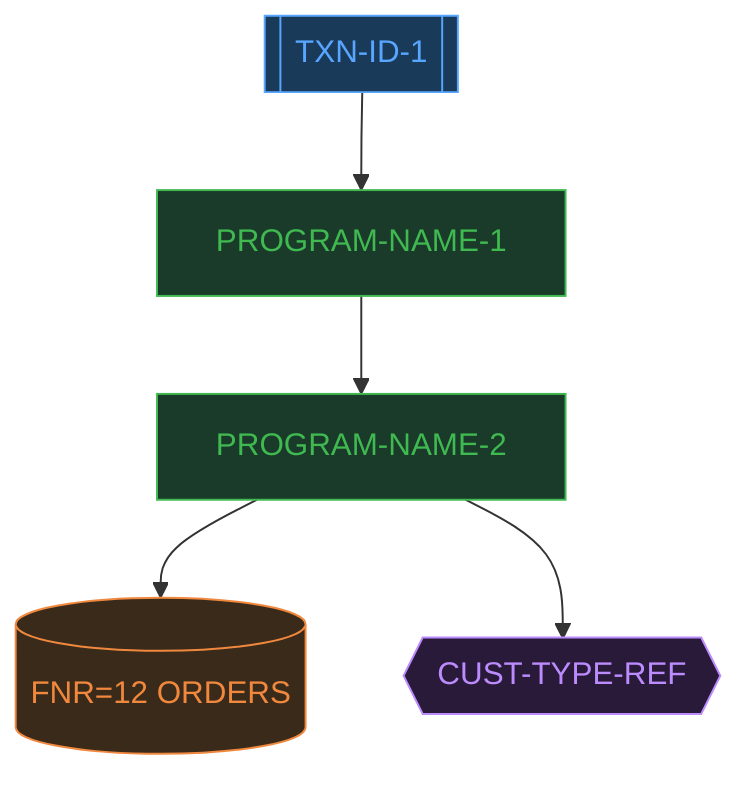
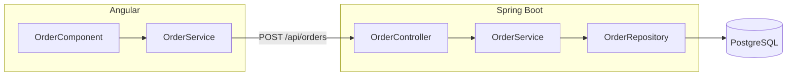

# Agent Output Schemas

Reference for the expected structure of each agent's output. Use this when integrating outputs into other tools or reviewing completeness.

---

## Agent 1 — Code Analysis Output Schema

```
# Code Analysis Report

## 1. Program Inventory
| Program Name | Type | Library | Description |
|…|…|…|…|

## 2. CICS Transaction Map
### Transaction: [TXN-ID]
- Entry Program: [NAME]
- Call Chain: [NAME] → [NAME] → [NAME]
- Screens: [MAP-NAME], [MAP-NAME]

## 3. Field Usage Matrix
| Field Name | Adabas File | Programs Reading | Programs Writing | Passed As Parameter |
|…|…|…|…|…|

## 4. Adabas File Access Summary
| FNR | File Name | Access Type | Fields Accessed | Programs |
|…|…|…|…|…|

## 5. Reference Table Usage
| Table Name | Key Field | Consuming Programs | Purpose |
|…|…|…|…|

## 6. Business Logic Highlights
[narrative per transaction]

## 7. Data Flows
[narrative per transaction]
```

---

## Agent 2 — BRD / FRD Output Schema

```
# Business Requirements Document

## 1. Executive Summary
## 2. Business Context & Objectives
## 3. Scope
### 3.1 In-Scope
### 3.2 Out-of-Scope
## 4. Stakeholders & Actors
| Actor | Role | Interaction |
## 5. Business Process Flows
### 5.1 [Process Name — e.g. Order Entry]
[plain English narrative]
## 6. Business Rules
| BR-ID | Rule Description | Source Program | Priority |
## 7. Data Requirements
| Entity | Business Meaning | Key Fields | Quality Rules |
## 8. Non-Functional Requirements
## 9. Assumptions & Constraints
## 10. Glossary

---

# Functional Requirements Document

## 1. System Overview
## 2. Functional Requirements
| FR-ID | Description | Source | Priority | Rationale |
## 3. Screen / UI Requirements
### Screen: [SCREEN-NAME] (from map [MAP-NAME])
| Field | Type | Mandatory | Validation | Default |
## 4. Data Requirements
## 5. Interface Requirements
## 6. Business Rule Catalogue
| BR-ID | Rule Text | Source Program | Fields | Impact |
## 7. Test Scenarios
```

---

## Agent 3 — Jira Stories Output Schema

```
## EPIC BREAKDOWN

### EP-001: [Epic Name]
Description: …
Business Value: …

---

## USER STORIES

### US-001 [EP-001]: As a [role]...
Source: [Natural program / CICS transaction]
Story Points: [n]
Priority: Must Have

#### Acceptance Criteria
\`\`\`gherkin
Given …
When …
Then …
\`\`\`

#### Technical Tasks
- FE: Angular [ComponentName]
- BE: [ControllerName] endpoint [verb] /api/[path]
- BE: [ServiceName].method()
- DB: [EntityName] (FNR=[n])
- TEST: Unit + integration

---

## RENOVATION-SPECIFIC STORIES
[data migration, ref table migration, regression, cutover]
```

---

## Agent 4 — Mermaid Diagram Output Schema

````
## Diagram 1 — Program Call Hierarchy



[explanation of hierarchy]

## Diagram 2 — Entity Relationship

```mermaid
erDiagram
  ORDERS ||--o{ ORDER-LINES : contains
  ORDERS }o--|| CUSTOMERS : "placed by"
  ORDERS { string ORDER-ID PK … }
```

[explanation]

## Diagram 3 — TO-BE Java + Angular Architecture


````

---

## Agent 5 — Java + Angular Output Schema

```
## Section 1 — Technology Mapping
| Mainframe Concept | Example | Java/Angular Equivalent | Notes |

## Section 2 — Java Code Stubs

### [ProgramName] Controller
\`\`\`java
@RestController … { }
\`\`\`

### [ProgramName] Service
\`\`\`java
@Service … { }
\`\`\`

### [FileName] Entity (FNR=[n])
\`\`\`java
@Entity … { }
\`\`\`

### [FileName] DTO
\`\`\`java
public record … { }
\`\`\`

## Section 3 — Angular Code Stubs

### [ScreenName] Component
\`\`\`typescript … \`\`\`

### [ScreenName] Template
\`\`\`html … \`\`\`

### [Feature] Service
\`\`\`typescript … \`\`\`

## Section 4 — Validation Migration
| Original Natural Validation | Java/Angular Equivalent |

## Section 5 — Database Migration Strategy

## Section 6 — Recommended Project Structure
```

---

## Agent 6 — Obsolescence Output Schema

```
# Obsolescence Report

## 1. Dead Fields
| Field Name | File/DDM | Reason | Risk | Recommendation |
| … | … | … | 🔴/🟡/🟢 | Remove / Review / Monitor |

## 2. Unused or Redundant Programs
| Program Name | Library | Last Evidence of Use | Risk | Recommendation |

## 3. Obsolete Validations
| Validation | Program | Reason Obsolete | Replacement in Java |

## 4. Reference Table Obsolescence
| Table Name | Entry Count | Programs Using | Recommendation |

## 5. Technical Debt Hotspots
| Pattern | Location | Refactor To |

## 6. Estimated Effort Savings
- Fields obsolete: ~N% of total DDM fields
- Programs deletable: N programs
- Validation code eliminated: ~N% (framework-handled)
- Consolidation: N programs → N service classes
```
